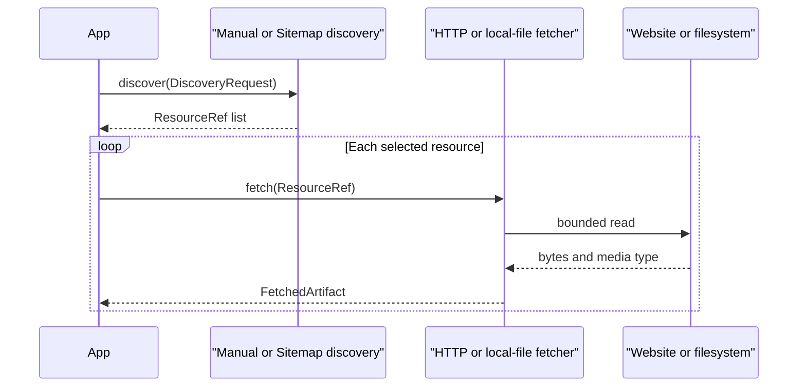

# ADAPT-001: Credential-free discovery and fetching adapters

## Phase metadata

| Field | Value |
|---|---|
| Phase ID | `ADAPT-001` |
| Status | In validation |
| Owner | Repository maintainer |
| Started | 2026-08-04 |
| Component | `doc_harvester.discovery`, `doc_harvester.fetchers` |
| Related issue / PR | To be assigned |
| Manual tests | [manual-test-cases.md](manual-test-cases.md) |
| Operator documentation | [Providers](../../providers.md) |

## Summary

Add the first concrete implementations of the universal discovery and fetch contracts:
manual URL discovery, sitemap/robots discovery, bounded HTTP fetching, and root-confined
local-file fetching. All four adapters work without accounts, tokens, or provider SDKs.

## Background

`CORE-001` defined stable pipeline interfaces but deliberately supplied no discovery or
fetch implementation. Open-source users need a useful credential-free starting point that
also demonstrates how new adapters should implement those interfaces safely.

## User story / use case

As an open-source integrator, I want to provide explicit document locations or a website
root and retrieve the resulting resources without a cloud account, so that I can build and
test an ingestion flow before configuring a search, storage, or publishing provider.

## Scope

### In scope

- Manual discovery from paths and `file`, `http`, or `https` URIs.
- Sitemap discovery from explicit sitemap files, conventional sitemap paths, and
  `Sitemap:` entries in `robots.txt`.
- Sitemap indexes, gzip sitemap files, deterministic deduplication, origin restrictions,
  and discovery bounds.
- Streaming HTTP fetching with time and byte limits.
- Root-confined local-file fetching with byte limits.
- Simple built-in adapter factories and public documentation.

### Out of scope

- Crawling links from discovered HTML pages.
- Applying robots allow/disallow rules to page fetching.
- Search-engine discovery, authentication, retries, caching, or object storage.
- CLI/profile orchestration of the new contracts.
- Extracting, chunking, storing, or publishing fetched artifacts.

## System constraints

- Python 3.11 and 3.12 remain supported.
- Adapters implement the synchronous `CORE-001` contracts.
- HTTP responses and decoded sitemap data are bounded before further processing.
- Local resources cannot escape the configured root through absolute paths, `..`, or
  resolved symlinks.
- Embedded URL credentials and remote file authorities are rejected.
- Existing legacy discovery and scraper behavior remains unchanged.

## Functional requirements

| ID | Requirement |
|---|---|
| `ADAPT-001-FR-01` | Manual discovery must preserve input order, remove fragments and duplicates, enforce the request limit, and reject unsupported schemes or embedded credentials. |
| `ADAPT-001-FR-02` | Sitemap discovery must inspect conventional sitemap locations and optional `robots.txt` sitemap declarations. |
| `ADAPT-001-FR-03` | Sitemap indexes and gzip sitemap files must be supported within configured sitemap and decoded-byte bounds. |
| `ADAPT-001-FR-04` | Sitemap discovery must reject unsafe URI schemes, embedded credentials, malformed ports, and cross-origin resources by default. |
| `ADAPT-001-FR-05` | HTTP fetching must stream content, enforce declared and actual byte limits, close responses, and return a normalized `FetchedArtifact`. |
| `ADAPT-001-FR-06` | Local fetching must support relative paths and local file URIs only below a configured root. |
| `ADAPT-001-FR-07` | Factories must list and create each built-in adapter and reject unknown names clearly. |

## Layouts and diagrams

## API requirements

| ID | Requirement |
|---|---|
| `ADAPT-001-API-01` | Adapters and factories must import from `doc_harvester.discovery` and `doc_harvester.fetchers`. |
| `ADAPT-001-API-02` | `create_discovery_provider` must support `manual` and `sitemap`. |
| `ADAPT-001-API-03` | `create_fetcher` must support `http` and `local-file`, with `file` and `local` aliases. |
| `ADAPT-001-API-04` | Fetch failures must use the public `FetchError` hierarchy. |
| `ADAPT-001-API-05` | Network sessions and sitemap fetchers must be injectable for offline tests and application control. |

## Data requirements

- Discovery returns universal `ResourceRef` values with source and guessed media type.
- Fetching returns universal `FetchedArtifact` values with bytes, media type, filename,
  HTTP status where applicable, and byte count.
- No discovery cache, database table, or persistent schema is added.

## Non-functional requirements

| ID | Requirement |
|---|---|
| `ADAPT-001-NFR-01` | All adapter behavior must be testable offline through dependency injection and temporary files. |
| `ADAPT-001-NFR-02` | Resource limits must prevent unbounded HTTP or decompressed sitemap reads. |
| `ADAPT-001-NFR-03` | Failure messages must omit URL queries, fragments, exception text, and credentials. |
| `ADAPT-001-NFR-04` | Existing standalone and DocProc suites must remain green. |
| `ADAPT-001-NFR-05` | The wheel must contain both new packages. |

## Logging and monitoring

The adapters do not configure application logging or emit metrics. Exceptions provide a
sanitized resource path and failure category so an orchestrator can log them without
including query tokens or upstream exception messages. Retry counts, latency, throughput,
and response metrics are deferred to orchestration work.

## Security and privacy

- URL user information is rejected instead of forwarded.
- HTTP error URLs are sanitized before inclusion in exceptions.
- Local filesystem access is confined to an explicit root after path resolution.
- XML containing document type or entity declarations is ignored.
- Sitemap traversal remains same-origin by default and accepts only absolute HTTP(S) URLs.

## Edge cases

- Empty manual entries, fragments, duplicates, and a request limit smaller than input.
- Missing `robots.txt` or conventional sitemap candidates.
- Malformed XML, corrupt gzip data, decompression beyond the configured limit, nested
  indexes, duplicate locations, cross-origin links, invalid ports, and unsafe schemes.
- Missing HTTP content length, inaccurate content length, empty stream chunks, HTTP errors,
  and network exceptions.
- Missing local files, absolute paths outside the root, `..` traversal, symlink escapes,
  remote file authorities, query strings on file URIs, and oversized files.

## Risks and mitigations

| Risk | Impact | Mitigation |
|---|---|---|
| A sitemap expands into excessive work | High | Bound decoded bytes, processed sitemap count, output count, schemes, and origin. |
| A local URI reads unintended host files | High | Resolve the path and require it to remain below the configured root. |
| A token leaks through an HTTP failure | High | Reject embedded credentials and sanitize URLs and upstream exceptions. |
| Users assume discovery is a full crawler | Medium | Document that HTML traversal and robots allow/disallow enforcement are out of scope. |

## Rollout, migration, and rollback

1. Publish the new additive packages and factories.
2. Verify them with offline tests, full regressions, packaging, and secret scans.
3. Wire adapters into orchestration in a separately documented phase.

No persistent or remote state is changed. Rollback is a normal code revert.

## Acceptance criteria

| ID | Criterion | Verification |
|---|---|---|
| `ADAPT-001-AC-01` | Manual discovery produces ordered, deduplicated, bounded resources. | `ADAPT-001-TC-01`; `tests/test_discovery_adapters.py` |
| `ADAPT-001-AC-02` | Sitemap and robots discovery handles indexes, gzip, malformed data, and unsafe links safely. | `ADAPT-001-TC-02`, `ADAPT-001-TC-03`; automated tests |
| `ADAPT-001-AC-03` | HTTP fetching is bounded, normalized, closed, and sanitized. | `ADAPT-001-TC-04`; `tests/test_fetchers.py` |
| `ADAPT-001-AC-04` | Local fetching is root-confined and bounded. | `ADAPT-001-TC-05`; `tests/test_fetchers.py` |
| `ADAPT-001-AC-05` | Factories, full regressions, wheel contents, and security checks pass. | `ADAPT-001-TC-06`; CI |

## Implementation outcome

Implemented:

- Manual and sitemap discovery adapters.
- HTTP and local-file fetchers with explicit safety bounds.
- Public factories, exports, documentation, and offline automated tests.

Deferred:

- CLI/profile orchestration, HTML crawling, retries, caching, and authenticated fetchers.

Verification evidence will be recorded after full local and pull-request validation.

Local verification completed:

- Ruff passed.
- Focused adapter suite: 21 passed.
- Complete standalone suite: 106 passed.
- Complete DocProc suite: 107 passed.
- Wheel build, contents inspection, and artifact import passed.
- Gitleaks complete-history and public working-tree scans passed.

Pull-request CI and CodeQL evidence remains pending.

## Decisions and open questions

| Status | Question or decision | Reason / owner |
|---|---|---|
| Decided | Keep this release programmatic rather than silently changing the legacy CLI. | Orchestration needs its own configuration and compatibility requirements. |
| Decided | Restrict sitemap traversal to one origin by default. | Safer behavior for untrusted sitemap content. |
| Deferred | Should a later orchestration layer support retry policies and disk-backed streaming? | Decide with crawler and large-file requirements. |
