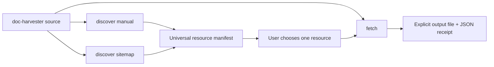

# CLI-001: Credential-free source orchestration

## Phase metadata

| Field | Value |
|---|---|
| Phase ID | `CLI-001` |
| Status | Complete |
| Owner | Repository maintainer |
| Started | 2026-08-04 |
| Completed | 2026-08-04 |
| Component | `doc_harvester.cli`, discovery and fetch adapters |
| Related issue / PR | [#10](https://github.com/getanotherone/doc-harvester/pull/10) |
| Manual tests | [manual-test-cases.md](manual-test-cases.md) |
| Operator documentation | [Configuration](../../configuration.md), [Providers](../../providers.md) |

## Summary

Expose the credential-free discovery and fetch adapters through an additive `source` CLI
group. Users can create a normalized resource manifest from manual locations or a sitemap,
then fetch one selected HTTP or local resource into an explicit output file.

## Background

`ADAPT-001` delivered safe programmatic adapters but intentionally left the legacy CLI
unchanged. A contributor currently needs Python code to exercise them. This phase adds a
public command surface without changing the behavior of the existing Yandex-oriented
`discover`, `crawl`, or `files` commands.

## User story / use case

As a credential-free user, I want to discover and fetch sources from the terminal, so that
I can validate inputs and inspect downloaded bytes before adding extraction, storage, or a
remote provider.

## Scope

### In scope

- `source discover manual` for explicit paths and URLs.
- `source discover sitemap` for a website root or sitemap URL.
- A versioned JSON discovery manifest written to stdout or an optional file.
- `source fetch` with automatic or explicit HTTP/local fetcher selection.
- Explicit fetch output, overwrite protection, atomic replacement, and JSON result output.
- CLI flags and environment defaults for fetch root, byte bounds, and HTTP timeout.
- Automated, manual, configuration, and README documentation.

### Out of scope

- Changing or removing existing commands.
- Automatically fetching every discovered resource.
- Extraction, chunking, quality evaluation, storage, or publishing orchestration.
- Retry policies, caches, resumable downloads, authentication, and scheduled jobs.
- A new persistent profile or database schema.

## System constraints

- Existing public commands and their default behavior remain compatible.
- Commands use the `ADAPT-001` factories and universal core models.
- Fetching never writes unless the user supplies `--output`.
- Existing output is preserved unless `--overwrite` is supplied.
- Local-file access remains confined to the configured fetch root.
- Limits must be positive and validated by the argument parser.
- JSON output is UTF-8 and deterministic enough for scripts and review.

## Functional requirements

| ID | Requirement |
|---|---|
| `CLI-001-FR-01` | `source discover manual` must accept one or more resource locations, a positive limit, and an optional manifest output. |
| `CLI-001-FR-02` | `source discover sitemap` must accept a root URI plus sitemap-count, XML-byte, HTTP-timeout, robots, and origin controls. |
| `CLI-001-FR-03` | Discovery must emit schema version, provider, count, and serialized universal resources. |
| `CLI-001-FR-04` | `source fetch` must select HTTP/local automatically from the URI or accept an explicit fetcher. |
| `CLI-001-FR-05` | Fetch must require an output file and refuse replacement unless `--overwrite` is supplied. |
| `CLI-001-FR-06` | A successful fetch must atomically write bytes and emit provider, resource, media type, filename, byte count, and output path. |
| `CLI-001-FR-07` | Fetch root, maximum bytes, and timeout must accept CLI overrides and documented environment defaults. |
| `CLI-001-FR-08` | Legacy CLI command parsing and behavior must remain unchanged. |

## Layouts and diagrams

## API requirements

| ID | Requirement |
|---|---|
| `CLI-001-API-01` | The top-level parser must expose a required `source` subcommand group. |
| `CLI-001-API-02` | Manual and sitemap modes must map only their supported arguments into `DiscoveryRequest` and adapter options. |
| `CLI-001-API-03` | Automatic fetch selection must choose HTTP for `http`/`https` and local-file for plain paths/`file`; other schemes fail clearly. |
| `CLI-001-API-04` | Manifest and receipt schemas must use `schema_version: 1`. |
| `CLI-001-API-05` | Command handlers return zero on success and propagate adapter failures without writing partial output. |

## Data requirements

- A discovery manifest contains `schema_version`, `provider`, `count`, and `resources`.
- Each resource contains `uri`, `source`, `media_type`, and a JSON-compatible metadata map.
- A fetch receipt contains the selected fetcher, source URI, output path, media type,
  filename, byte count, and safe adapter metadata.
- Manifests may contain source query parameters required for later retrieval and therefore
  must be treated as potentially sensitive operational artifacts.

## Non-functional requirements

| ID | Requirement |
|---|---|
| `CLI-001-NFR-01` | All manual/local flows and network orchestration must be testable without external network access. |
| `CLI-001-NFR-02` | Output replacement must be atomic within the destination directory. |
| `CLI-001-NFR-03` | Help text must make write, overwrite, limit, root, robots, and cross-origin behavior explicit. |
| `CLI-001-NFR-04` | Standalone, DocProc, packaging, secret, and CodeQL checks must pass. |

## Logging and monitoring

Commands emit one JSON document on success. They do not add application logging or remote
telemetry. Adapter exceptions retain their existing sanitized failure behavior. Exit code
zero means the requested manifest or fetch completed; parser and adapter failures are
non-zero through the existing CLI exception boundary.

## Security and privacy

- No credential option is added.
- Embedded URL credentials remain rejected by adapters.
- Fetch writes require an explicit destination and existing files are protected by default.
- Local sources remain confined after path resolution.
- Manifest and receipt files may preserve source query parameters; users must not attach
  them publicly without review.

## Edge cases

- Duplicate/manual fragment URIs, a limit smaller than the input, or unsupported schemes.
- Missing/corrupt sitemaps, cross-origin locations, robots disabled, and bounded gzip XML.
- Plain path, local file URI, HTTP(S), unsupported scheme, and explicitly mismatched fetcher.
- Missing output parent, existing output, overwrite requested, zero/negative limits,
  zero/negative timeout, and invalid numeric environment defaults.
- Empty fetched bytes and filenames that differ from the chosen output name.

## Risks and mitigations

| Risk | Impact | Mitigation |
|---|---|---|
| New commands accidentally alter legacy behavior | High | Add a separate `source` group and retain legacy parser tests. |
| Batch discovery causes unintended bulk download | High | Discovery only emits a manifest; fetch accepts one resource. |
| A fetch overwrites user data | High | Require explicit output and opt-in `--overwrite`; use atomic replacement. |
| Output exposes a signed source URL | Medium | Document manifests/receipts as potentially sensitive and never log adapter exception text. |

## Rollout, migration, and rollback

1. Add the new command group without changing legacy commands.
2. Validate offline fixtures, output schemas, write safeguards, full regressions, and CI.
3. Document a credential-free manual and sitemap workflow.

No migration is required. Rollback removes the additive command group and documentation;
no persistent schema or remote state is involved.

## Acceptance criteria

| ID | Criterion | Verification |
|---|---|---|
| `CLI-001-AC-01` | Manual CLI discovery emits the correct universal manifest. | `CLI-001-TC-01`; CLI tests |
| `CLI-001-AC-02` | Sitemap CLI discovery passes safe bounds and controls into its adapter. | `CLI-001-TC-02`; CLI tests |
| `CLI-001-AC-03` | Local and HTTP fetch orchestration selects correctly and emits a receipt. | `CLI-001-TC-03`, `CLI-001-TC-04`; CLI tests |
| `CLI-001-AC-04` | Existing output and invalid settings fail without partial replacement. | `CLI-001-TC-05`; CLI tests |
| `CLI-001-AC-05` | Legacy commands, complete tests, package, secret scan, and CI remain green. | `CLI-001-TC-06`; CI |

## Implementation outcome

Implemented:

- Additive `source discover manual`, `source discover sitemap`, and `source fetch` commands.
- Versioned resource manifests and fetch receipts.
- Safe fetcher inference, explicit output, overwrite protection, and atomic replacement.
- Portable Markdown media-type inference across supported operating systems/Python versions.
- Flag and exported-environment configuration for limits, root, and HTTP timeout.
- Public help, README, configuration, provider, and manual-test documentation.

Local verification:

- Focused source/adapter/legacy CLI suite: 44 passed.
- Complete standalone suite: 123 passed.
- Complete DocProc suite: 107 passed.
- Ruff, diff validation, wheel contents/import, CLI artifact smoke test, and Gitleaks
  complete-history/public-tree scans passed.
- Real local manual discovery/fetch smoke test produced and byte-compared a README copy.
- PR #10 standalone 3.11/3.12, DocProc, secrets, and CodeQL checks passed.
- The CI portability failure found on the first run was resolved with deterministic
  Markdown media types and dedicated cross-platform regression tests.

## Decisions and open questions

| Status | Question or decision | Reason / owner |
|---|---|---|
| Decided | Add `source` instead of overloading legacy `discover`. | Avoid a breaking positional-argument and output-schema change. |
| Decided | Fetch one resource per invocation. | Keeps writes deliberate and failure handling understandable. |
| Deferred | Should a later pipeline command consume a manifest and extract/chunk each resource? | Requires naming, concurrency, retry, and checkpoint requirements. |
