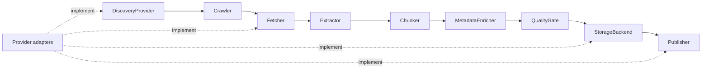

# CORE-001: Universal core contracts

## Phase metadata

| Field | Value |
|---|---|
| Phase ID | `CORE-001` |
| Status | In validation |
| Owner | Repository maintainer |
| Started | 2026-08-04 |
| Completed | Pending validation |
| Component | `doc_harvester.core` |
| Related issue / PR | Pending |
| Manual tests | [manual-test-cases.md](manual-test-cases.md) |
| Operator documentation | [Providers](../../providers.md) |

## Summary

Introduce a stable, provider-neutral Python API for every stage from discovery through
publication. The core contains only contracts and portable data models; provider SDKs,
credentials, network behavior, databases, and concrete adapters remain outside it.

## Background

Storage and publishing already had public contracts, while the other pipeline concepts
existed only as flat standalone functions or DocProc-internal protocols. That prevented a
new search engine, crawler, fetch transport, extractor, chunking strategy, enricher, or
quality implementation from targeting one shared public boundary.

## User story / use case

As an open-source integrator, I want stable provider-neutral interfaces for each ingestion
stage, so that I can add or replace one provider without importing legacy Yandex modules or
rewriting the rest of the pipeline.

Secondary use cases:

- Test a complete ingestion flow with in-memory implementations and no network access.
- Migrate the standalone runtime and DocProc incrementally without breaking existing users.
- Keep local, S3, Wiki, Notion, and future adapters behind shared contracts.

## Scope

### In scope

- Public contracts for `DiscoveryProvider`, `Crawler`, `Fetcher`, `Extractor`, `Chunker`,
  `MetadataEnricher`, `QualityGate`, `StorageBackend`, and `Publisher`.
- Portable data models for resources, crawl policy, fetched bytes, extraction blocks,
  chunks, enrichment, quality reports, storage results, and publication requests/results.
- Compatibility bridges for existing `StorageProvider` and publisher import paths.
- Packaging, documentation, and automated provider-neutrality tests.

### Out of scope

- Rewriting the legacy standalone scraper to use every contract in one change.
- Moving DocProc parsers and chunkers into the standalone package.
- New Google, sitemap, HTTP, filesystem, object-storage, or format adapters.
- A dependency-injection container, plugin registry, async contract, or persisted schema.

## System constraints

- Python 3.11 and 3.12 remain supported.
- `doc_harvester.core` may import only the Python standard library and itself.
- The core must not import Yandex, Notion, Confluence, S3, database, queue, or web SDK code.
- Existing `doc_harvester.storage` and `doc_harvester.publishers` consumers remain compatible.
- The standalone and DocProc runtimes remain independently deployable.

## Assumptions and dependencies

- Concrete adapters may remain synchronous during this phase; async orchestration is deferred.
- `Sequence` return types allow list, tuple, or other ordered implementations without fixing
  a persistence choice.
- Existing format-specific models can be translated to the portable core models by future
  adapter work.

## Functional requirements

| ID | Requirement |
|---|---|
| `CORE-001-FR-01` | The public package must expose all nine named pipeline contracts from `doc_harvester.core`. |
| `CORE-001-FR-02` | Discovery inputs must represent search queries, root/sitemap locations, and manual resource URIs without naming a search vendor. |
| `CORE-001-FR-03` | Crawl policy must express traversal bounds, delay, robots behavior, domain restrictions, and include/exclude filtering. |
| `CORE-001-FR-04` | Fetch and extraction contracts must carry raw bytes and normalized blocks without coupling to HTTP or a file format. |
| `CORE-001-FR-05` | Chunking must accept an explicit strategy name and validated token/overlap options. |
| `CORE-001-FR-06` | Metadata enrichment and quality evaluation must operate on normalized documents and chunks. |
| `CORE-001-FR-07` | Storage must support original bytes, files, and processed artifact trees through `StorageBackend`. |
| `CORE-001-FR-08` | Publishing must preserve the existing safe-by-default dry-run and explicit create behavior. |
| `CORE-001-FR-09` | Existing storage and publisher adapters must satisfy the new core contracts without breaking their public import paths. |

## Layouts and diagrams

## API requirements

| ID | Requirement |
|---|---|
| `CORE-001-API-01` | `from doc_harvester.core import ...` must expose every contract and shared model. |
| `CORE-001-API-02` | Contracts use abstract methods and a required provider/strategy `name`. |
| `CORE-001-API-03` | Invalid bounds such as zero pages, negative delay, or overlap greater than/equal to chunk size must raise `ValueError`. |
| `CORE-001-API-04` | `doc_harvester.storage.StorageProvider` remains a compatibility subtype of `StorageBackend`. |
| `CORE-001-API-05` | `doc_harvester.publishers.Publisher` and `doc_harvester.core.Publisher` resolve to the same contract. |

## Data requirements

- Core models are dataclasses and use `Mapping[str, Any]` extension metadata.
- No database migration or persistent schema is introduced.
- Raw content remains bytes until extraction; normalized content uses blocks and chunks.
- Provider-private response objects, tokens, and destination IDs must not enter shared models
  unless an adapter deliberately places a safe value in metadata.

## Non-functional requirements

| ID | Requirement |
|---|---|
| `CORE-001-NFR-01` | Importing `doc_harvester.core` must require no optional provider SDK, credential, database, or network call. |
| `CORE-001-NFR-02` | Static import inspection must find no provider-specific module in the core package. |
| `CORE-001-NFR-03` | All existing standalone and DocProc tests must continue to pass. |
| `CORE-001-NFR-04` | The distributable package must include `doc_harvester.core`. |

## Logging and monitoring

Not applicable — contracts perform no network or pipeline work and therefore emit no logs
or metrics. Concrete implementations remain responsible for sanitized stage timing,
failure, retry, and rate-limit telemetry.

## Security and privacy

- Core models contain no credential fields.
- Provider authentication remains inside concrete adapter configuration.
- Publication remains dry-run by default.
- Metadata must not be used to bypass the repository's credential and private-URL rules.

## Edge cases

- Empty discovery requests and resource URIs.
- Zero page limits, negative delays, and invalid chunk overlaps.
- Empty fetched content or extracted block collections; quality gates decide acceptance.
- Unsupported media types; extractors report support before extraction.
- Hidden files in storage trees remain excluded by the inherited storage behavior.
- A provider may return fewer resources than requested without violating the contract.

## Risks and mitigations

| Risk | Impact | Mitigation |
|---|---|---|
| Contracts become too tied to the legacy implementation | High | Use normalized models and keep concrete migration out of this phase. |
| Existing adapters break after moving base classes | High | Re-export old import paths and run storage/publisher regression tests. |
| Provider code leaks into core imports | High | AST-based import regression test and CI. |
| Sync contracts constrain future async work | Medium | Keep orchestration out of the contract and treat async variants as a versioned follow-up. |

## Rollout, migration, and rollback

1. Publish the additive core package and compatibility bridges.
2. Verify imports, adapter inheritance, the offline composition test, and both test suites.
3. Migrate concrete implementations incrementally in later phases.

Rollback is a normal code revert: this phase changes no external or persistent state.

## Acceptance criteria

| ID | Criterion | Verification |
|---|---|---|
| `CORE-001-AC-01` | Every named interface and shared model imports from `doc_harvester.core`. | `CORE-001-TC-01`; `tests/test_core_contracts.py` |
| `CORE-001-AC-02` | A synthetic pipeline composes discovery through quality evaluation without a provider SDK. | `CORE-001-TC-02`; `test_universal_contracts_compose_without_provider_dependencies` |
| `CORE-001-AC-03` | Core source has no provider-specific imports. | `CORE-001-TC-03`; `test_core_package_has_no_provider_specific_imports` |
| `CORE-001-AC-04` | Existing storage and publisher contracts remain compatible. | `CORE-001-TC-04`; storage/publisher regression suites |
| `CORE-001-AC-05` | Invalid portable policy boundaries fail clearly. | `test_core_validates_portable_policy_boundaries` |
| `CORE-001-AC-06` | Full lint, standalone, DocProc, packaging, and secret checks pass. | `CORE-001-TC-05`; CI |

## Implementation outcome

Implemented:

- `doc_harvester.core` models and contracts.
- Compatibility bridges for storage and publishing.
- Package configuration and focused automated coverage.
- Public architecture/provider documentation.

Not completed or deferred:

- Concrete adapter migration and registries are deferred to later phases.
- Async interfaces are deferred until a concrete cross-runtime requirement exists.

Verification evidence:

- Focused lint passed.
- Focused core/storage/publisher tests: 16 passed.
- Complete suite, wheel, Gitleaks, and CI evidence pending final validation.

## Decisions and open questions

| Status | Question or decision | Reason / owner |
|---|---|---|
| Decided | Keep core contracts synchronous in `CORE-001`. | Matches current standalone behavior and avoids premature dual sync/async APIs. |
| Decided | Keep legacy storage/publisher import paths. | Backward compatibility for existing users and plugins. |
| Deferred | When should standalone and DocProc concrete stages implement these contracts directly? | Plan per-stage migrations after the interface release. |
