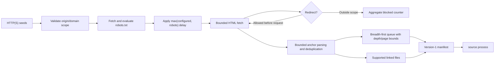

# CRAWL-001: Safe provider-neutral web crawling

## Summary

| Field | Value |
|---|---|
| Phase ID | `CRAWL-001` |
| Status | Complete |
| Depends on | `CORE-001`, `ADAPT-001`, `CLI-001`, `PIPE-001` |
| Scope | Bounded, robots-aware HTML traversal that produces a version-1 processing manifest |

This phase implements the universal `Crawler` contract with a credential-free HTML adapter
and adds `source crawl`. The safe defaults enforce robots.txt, same-origin traversal, a
one-second crawl-fetch delay, three link levels, bounded HTML/robots/link parsing, and a maximum
of 100 fetched pages and manifest resources.

## Background

The universal workflow could discover explicit URLs and sitemaps but could not traverse links
from HTML. The legacy scraper had domain-specific traversal behavior that was unsuitable as a
portable core adapter. A general crawler must avoid crawl traps, cross-origin expansion,
robots violations, silent redirect escapes, unbounded responses, and logs that reproduce
private URLs or network errors.

## User story / use case

As an open-source operator, I want to crawl a documentation site conservatively into the same
manifest consumed by `source process`, so I can use the provider-neutral extraction pipeline
without search-provider credentials or the legacy electrical-domain profile.

## System constraints

- Seeds must be absolute HTTP(S) URLs without embedded credentials.
- Empty `allowed_domains` means exact seed origins only; cross-origin links are not requested.
- Explicit allowed domains are hostnames without schemes or ports.
- Robots failure is fail-closed except HTTP 404/410, which means no robots file.
- Effective delay is the maximum of configured delay and robots crawl-delay.
- `max_pages` bounds both fetched HTML pages and returned manifest resources.
- `max_depth`, response bytes, robots bytes, and links per page are independently bounded.
- Exclude globs block traversal; include globs filter output but allow bridge-page traversal.
- Known supported linked files may enter the manifest without being downloaded during crawl.
- Redirect targets are validated before the next request and must stay in the allowed scope.
- Manifests contain full resource URIs and must be reviewed before sharing.

## Functional requirements

| ID | Requirement |
|---|---|
| `CRAWL-001-FR-01` | Traverse HTTP(S) HTML anchors breadth-first from one or more validated seeds. |
| `CRAWL-001-FR-02` | Enforce unique normalized/defragmented URLs and exact seed-origin scope by default. |
| `CRAWL-001-FR-03` | Fetch and enforce one robots policy per origin, including applicable crawl-delay. |
| `CRAWL-001-FR-04` | Fail closed when robots cannot be evaluated, except explicit HTTP 404/410. |
| `CRAWL-001-FR-05` | Enforce page/resource, depth, HTML-byte, robots-byte, link-count, and timeout bounds. |
| `CRAWL-001-FR-06` | Apply exclusion globs before traversal and inclusion globs only to manifest selection. |
| `CRAWL-001-FR-07` | Discover supported linked documents without downloading them during traversal. |
| `CRAWL-001-FR-08` | Evaluate every redirect target before following it and reject scope escapes. |
| `CRAWL-001-FR-09` | Emit a version-1 resource manifest with per-resource depth and an aggregate crawl report. |
| `CRAWL-001-FR-10` | Protect an existing output manifest unless `--overwrite` is explicit. |

## Layouts and diagrams

## API requirements

| ID | Requirement |
|---|---|
| `CRAWL-001-API-01` | `HTMLCrawler`, `create_crawler`, and `available_crawlers` are public under `doc_harvester.crawlers`. |
| `CRAWL-001-API-02` | `HTMLCrawler` implements the universal synchronous `Crawler.crawl` contract. |
| `CRAWL-001-API-03` | `CrawlPolicy` gains backward-compatible non-negative `max_depth` with default `3`. |
| `CRAWL-001-API-04` | `HTTPFetcher` manually follows at most five redirects and accepts a pre-request redirect validator. |
| `CRAWL-001-API-05` | `source crawl SEED...` exposes scope, robots, delay, pattern, depth/page/byte/link/timeout, and output controls. |
| `CRAWL-001-API-06` | Canonical environment variables use `DOC_HARVESTER_CRAWL_*`. |

## Non-functional requirements

| ID | Requirement |
|---|---|
| `CRAWL-001-NFR-01` | Results and breadth-first ordering are deterministic for the same responses. |
| `CRAWL-001-NFR-02` | Crawl errors are isolated and summarized by count without raw response/error text. |
| `CRAWL-001-NFR-03` | Unsupported schemes, embedded credentials, and cross-origin redirects are rejected safely. |
| `CRAWL-001-NFR-04` | The complete adapter/CLI path is testable against a loopback-only synthetic site. |
| `CRAWL-001-NFR-05` | Core remains provider-neutral and no Yandex-specific module is imported. |
| `CRAWL-001-NFR-06` | Existing fetch, discovery, processing, storage, review, and publishing behavior remains compatible. |
| `CRAWL-001-NFR-07` | Full regression, package, secret, CI, and CodeQL checks remain green. |

## Logging and monitoring

The manifest includes aggregate fetched/discovered, robots/filter/unsupported/fetch/redirect
counters and a truncation flag. Raw exceptions and failed URLs are not copied into that
report. The manifest resources necessarily contain URLs, including query parameters; keep
raw manifests local or sanitize them before attaching to issues. Production operators should
monitor request counts, HTTP status rates, crawl duration, provider access logs, and any
robots or terms-of-service changes.

## Edge cases

- Empty, relative, unsupported-scheme, malformed-port, or credential-bearing seed.
- Duplicate seed, fragment variants, default ports, relative links, and link cycles.
- Multiple seeds with different exact origins.
- Missing (404/410), unavailable, oversized, malformed, or redirected robots file.
- Robots groups, disallowed path, and larger robots crawl-delay.
- Cross-origin, credential-bearing, JavaScript, mail, or malformed link.
- Same-origin redirect chain, cross-origin redirect, missing Location, and redirect loop/limit.
- HTML content type with invalid bytes or malformed tags.
- Unsupported image/archive link and supported PDF/DOCX/XLSX/text/XML link.
- Include filter matching nothing while traversal still hits the fetch-page limit.
- Exclusion filter on a bridge page.
- Page at maximum depth with further links.
- More anchors than the per-page bound.
- Existing, symlinked, or unwritable output path.
- Network failure after earlier pages succeeded.

## Acceptance criteria

| ID | Criterion | Verification |
|---|---|---|
| `CRAWL-001-AC-01` | A synthetic site crawls breadth-first into a process-compatible manifest. | `CRAWL-001-TC-01`; loopback integration |
| `CRAWL-001-AC-02` | Robots disallow/crawl-delay, unavailable fail-closed, and 404 allow behavior work. | `CRAWL-001-TC-02`; robots tests |
| `CRAWL-001-AC-03` | Scope, patterns, depth, page/fetch, byte, and link bounds prevent expansion. | `CRAWL-001-TC-03`; boundary tests |
| `CRAWL-001-AC-04` | Cross-origin redirect is rejected before contacting the target. | `CRAWL-001-TC-04`; sequential-session test |
| `CRAWL-001-AC-05` | Existing output is protected and CLI/configuration/package surfaces are complete. | `CRAWL-001-TC-05`; CLI/config/wheel checks |
| `CRAWL-001-AC-06` | Full regression, secret, PR, and post-merge checks pass. | `CRAWL-001-TC-06` |

## Decisions and open questions

| Status | Decision | Reason |
|---|---|---|
| Decided | Default to exact seed-origin traversal. | Prevents accidental expansion to unrelated hosts or ports. |
| Decided | Fail closed when robots is unavailable for reasons other than absence. | Avoids crawling when site policy cannot be evaluated. |
| Decided | Let include filters select output while allowing bridge traversal. | Supports deep documentation sections without requiring every parent URL to match. |
| Decided | Treat exclude filters as hard traversal blocks. | Prevents requests to known private, dynamic, or trap paths. |
| Decided | Count both fetched HTML and returned resources against `max_pages`. | Keeps selective crawls bounded even when few URLs match. |
| Decided | Do not download recognized linked documents during crawl. | Avoids duplicate large transfers before processing and preserves stage separation. |
| Decided | Disable robots only through an explicit warning-labeled CLI flag. | Some owner-authorized test environments need it, but it is never the default. |
| Deferred | Canonical URL/link-rel rules, query-parameter policies, and persistent crawl checkpoints. | Need evidence from broader sites and explicit privacy/retention decisions. |
| Deferred | JavaScript/browser rendering. | Adds a substantially larger execution and security boundary. |
| Deferred | Async/concurrent crawling. | Requires per-origin rate coordination, cancellation, and deterministic checkpoint policy. |

## Implementation outcome

Implemented:

- public HTML crawler and factory satisfying the universal core contract;
- bounded robots-aware breadth-first traversal with deterministic deduplication;
- pre-request redirect validation and aggregate privacy-safe crawl reporting;
- additive `source crawl` command, canonical safe defaults, and atomic output protection;
- mapping-based unit coverage and a real loopback HTTP integration test.

Local verification on 2026-08-05:

- Focused crawler/core/fetcher/CLI/configuration/package suite passed: 60 tests.
- Ruff and complete standalone suite passed: 260 tests.
- Complete DocProc suite passed: 107 tests.
- Real loopback HTTP crawl fetched only robots/root/guide, discovered the linked PDF without
  fetching it, blocked the private route, and produced a process-compatible manifest.
- Wheel build/content inspection and extracted-wheel loopback crawl passed after adding a
  package-discovery regression check for every public `doc_harvester` package.
- Complete 52-commit history scan found no leaks.

Public and post-merge verification on 2026-08-05:

- [PR #21](https://github.com/getanotherone/doc-harvester/pull/21) passed all seven checks
  and was squash-merged as `20d9742`.
- Local `main` fast-forwarded to the merge commit with a clean working tree.
