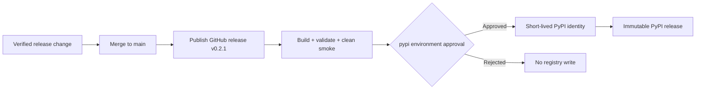

# DIST-001: PyPI distribution and community launch

## Phase metadata

| Field | Value |
|---|---|
| Phase ID | `DIST-001` |
| Status | In validation |
| Owner | `getanotherone` |
| Started | `2026-08-06` |
| Completed | Not applicable |
| Component | Packaging, release automation, contributor experience |
| Related issue / PR | To be added after PR creation |
| Manual tests | [manual-test-cases.md](manual-test-cases.md) |
| Operator documentation | [PyPI publishing](../../operations/pypi-publishing.md) |

## Summary

DIST-001 makes the CLI-first MVP installable from PyPI through a release-gated,
token-free publishing workflow and creates a safe path for first users to report problems
or contribute. Registry setup and the first remote publication remain explicit maintainer
approval steps.

## Background

The `0.2.0` MVP is available as a GitHub release and passes clean-wheel tests, but normal
users must still clone the source repository. The project also has contribution guidance
but no structured issue intake or beginner-sized public backlog. These gaps increase
installation friction and make independent usage difficult to establish.

## User story / use case

As a new user, I want to install doc-harvester with pip and complete an offline demo, so I
can evaluate it without learning the repository's development setup.

As a prospective contributor, I want safe issue forms and clearly scoped starter work, so
I can provide useful feedback without exposing private documents or credentials.

## Scope

### In scope

- Package metadata and version `0.2.1` for the first PyPI-ready release.
- GitHub-release-triggered build, validation, smoke test, and Trusted Publishing.
- PyPI operator documentation and rollback rules.
- README installation improvements, issue forms, and first-community guidance.

### Out of scope

- Automatically creating a PyPI/GitHub account or bypassing maintainer approval.
- Publishing before the protected workflow and clean-install checks pass.
- Marketing automation, user tracking, telemetry, or inflated adoption claims.

## System constraints

- Python 3.11+ remains supported.
- PyPI versions and distribution files are immutable.
- The release tag must exactly equal `v` plus the package version.
- Only the publish job may request an OIDC identity token.
- Public issue forms must warn against sensitive logs, URLs, paths, or documents.

## Assumptions and dependencies

- The `doc-harvester` PyPI name was unregistered when checked on 2026-08-06; it must be
  checked again during setup because availability is not reserved by this repository.
- The maintainer will configure a PyPI account, a pending Trusted Publisher, and the GitHub
  `pypi` environment before publishing `v0.2.1`.

## Functional requirements

| ID | Requirement |
|---|---|
| `DIST-001-FR-01` | Package metadata must expose repository, documentation, issue, source, and changelog links. |
| `DIST-001-FR-02` | Publishing must trigger only when a GitHub release is published and its tag matches the package version. |
| `DIST-001-FR-03` | The workflow must build wheel and source distributions, validate metadata, and smoke-test the wheel before publishing. |
| `DIST-001-FR-04` | PyPI authentication must use Trusted Publishing without a stored PyPI password or API token. |
| `DIST-001-FR-05` | Users must have a pip-first quick start and contributors must have structured bug/feature intake. |
| `DIST-001-FR-06` | Maintainers must have documented setup, verification, failure, yanking, and follow-up release procedures. |

## Layouts and diagrams

## API requirements

| ID | Requirement |
|---|---|
| `DIST-001-API-01` | The distribution name remains `doc-harvester` and console command remains `doc-harvester`. |
| `DIST-001-API-02` | Package and runtime versions must both report `0.2.1`. |
| `DIST-001-API-03` | Existing optional dependency names and public CLI commands remain compatible. |

## Data requirements

PyPI receives only build distributions and public package metadata. Smoke tests use
embedded synthetic data and temporary output. No analytics, credentials, user documents,
or generated datasets are added.

## Non-functional requirements

| ID | Requirement |
|---|---|
| `DIST-001-NFR-01` | A clean base-wheel install must complete the version and offline demo smoke tests. |
| `DIST-001-NFR-02` | Registry credentials must not be stored in GitHub secrets, files, or logs. |
| `DIST-001-NFR-03` | A failed build, metadata check, smoke test, or approval must prevent publication. |
| `DIST-001-NFR-04` | Contributor intake must discourage disclosure of private or copyrighted material. |

## Logging and monitoring

GitHub Actions records build, validation, smoke, approval, and publication status. PyPI is
the authoritative public record of published versions and files. Logs must not contain
credentials or demo content. No runtime user telemetry is introduced.

## Security and privacy

- The publish job alone receives `id-token: write`; the build job remains read-only.
- The GitHub `pypi` environment is the human approval boundary.
- Third-party changes to the publishing workflow require careful maintainer review.
- Bug reports explicitly require sanitized reproduction data.

## Edge cases

- The package name is claimed before first publication.
- A release is published with a tag that does not match project metadata.
- One distribution builds successfully while metadata or clean installation fails.
- The Trusted Publisher owner, repository, workflow, or environment is mistyped.
- The GitHub release exists but PyPI publication fails or is rejected.
- A version partially reaches PyPI and cannot be overwritten.

## Risks and mitigations

| Risk | Impact | Mitigation |
|---|---|---|
| Compromised publishing workflow | High | Minimal permissions, protected environment, OIDC, and focused review. |
| Broken immutable release | High | Build, metadata validation, and clean-wheel smoke before publish; patch release for recovery. |
| Sensitive issue content | High | Structured warnings, private security link, maintainer redaction/removal response. |
| Downloads mistaken for users | Medium | Track independent feedback separately and describe downloads only as aggregate usage. |

## Rollout, migration, and rollback

1. Merge the verified workflow and packaging change.
2. Configure the exact PyPI Trusted Publisher and GitHub `pypi` environment.
3. Publish `v0.2.1`, approve the environment, and clean-install from PyPI.
4. If publication fails before upload, fix and retry the workflow only when safe.
5. If any artifact reached PyPI, increment the patch version; yank an unsafe release rather
   than attempting to replace immutable files.

No user data migration is required.

## Acceptance criteria

| ID | Criterion | Verification |
|---|---|---|
| `DIST-001-AC-01` | Distribution metadata and `0.2.1` version are consistent and valid. | `DIST-001-TC-01`; packaging tests |
| `DIST-001-AC-02` | The publishing workflow is release/tag gated, smoke-tested, and token-free. | `DIST-001-TC-02`; workflow contract test |
| `DIST-001-AC-03` | A clean local artifact install completes version and demo commands. | `DIST-001-TC-03`; CI build job |
| `DIST-001-AC-04` | First users and contributors have safe, discoverable instructions and forms. | `DIST-001-TC-04`; documentation review |
| `DIST-001-AC-05` | PyPI `0.2.1` can be installed and run after explicit maintainer approval. | `DIST-001-TC-05` |

## Implementation outcome

Implemented:

- PyPI project URLs, synchronized `0.2.1` metadata, and pip-first README path.
- Release-triggered build/publish separation with tag validation and Trusted Publishing.
- Maintainer publishing/rollback guide, community launch guide, and structured issue forms.
- Automated metadata and release-workflow contract coverage.

Not completed or deferred:

- PyPI/GitHub account configuration and remote `0.2.1` publication require maintainer action.
- Public starter issues should be opened after these contributor instructions merge.

Verification evidence:

- Ruff, all 265 standalone tests, and all 107 DocProc tests passed; all GitHub YAML parsed.
- Wheel and source distribution passed Twine validation. A clean Python 3.11 environment
  installed the wheel, reported `0.2.1`, and completed the offline demo.
- Remote publication remains blocked by the deliberate account, merge, and approval gates.

## Decisions and open questions

| Status | Question or decision | Reason / owner |
|---|---|---|
| Decided | Use `v0.2.1` for the first PyPI publication. | `v0.2.0` was released before the registry workflow existed. |
| Decided | Trigger only from published GitHub releases. | Keeps publication deliberate and ties it to a public release record. |
| Decided | Do not collect in-product telemetry. | External feedback and aggregate registry data are sufficient for the initial launch. |
