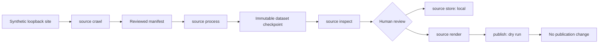

# E2E-001: Credential-free universal golden path

## Summary

| Field | Value |
|---|---|
| Phase ID | `E2E-001` |
| Status | Complete |
| Depends on | `CRAWL-001`, `PIPE-001`, `PIPE-002`, `REVIEW-001`, `STORE-001`, `PUB-002` |
| Scope | Prove the provider-neutral stages compose into one review-gated local workflow |

E2E-001 adds a public contributor walkthrough, a reusable synthetic site, and a real
loopback integration test covering crawl through publication preview. It does not add an
automatic all-in-one command: manifests, datasets, inventories, stored copies, and rendered
Markdown remain explicit checkpoints.

## Background

The universal stages had comprehensive isolated tests, but contributors still lacked one
credential-free proof that their schemas and safety boundaries work together. A unit test
can confirm a contract while missing filename, media-type, CLI, filesystem, or handoff
incompatibilities between stages. The golden path closes that gap without relying on a
maintainer account or a mutable public website.

## User story / use case

As an open-source contributor, I want to run one deterministic local workflow from a
synthetic website to a publication preview, so I can verify my environment and understand
the review boundaries without credentials, private data, cloud costs, or remote changes.

## System constraints

- All network traffic is bound to a disposable loopback HTTP server.
- Fixtures contain only synthetic technical content and fake identifiers.
- Robots policy, origin scope, page/depth/byte/link bounds, and output protections remain active.
- Every stage writes a distinct explicit artifact; later stages never mutate earlier ones.
- Source URIs and bodies stay out of the default inventory output.
- Quality failures remain visible in inspection and rendered Markdown.
- Publication ends in dry-run preview; no local or remote publication is applied.
- Existing datasets, stored objects, renders, and publications are preserved by default.

## Functional requirements

| ID | Requirement |
|---|---|
| `E2E-001-FR-01` | Crawl a loopback site into a valid version-1 manifest while enforcing robots. |
| `E2E-001-FR-02` | Process discovered HTML, PDF, DOCX, XLSX, XML, and text through real fetcher/extractor selection. |
| `E2E-001-FR-03` | Inspect the dataset without including source URIs or document bodies. |
| `E2E-001-FR-04` | Store the validated dataset through the local `StorageBackend`. |
| `E2E-001-FR-05` | Render one selected document with its quality status visible. |
| `E2E-001-FR-06` | Preview publication through the local `Publisher` without applying it. |
| `E2E-001-FR-07` | Refuse a processing restart at an existing output before any new fetch. |
| `E2E-001-FR-08` | Provide a copyable contributor walkthrough using repository-owned fixtures. |

## Layouts and diagrams

## API requirements

| ID | Requirement |
|---|---|
| `E2E-001-API-01` | Use only public `doc-harvester` CLI commands and version-1 artifacts. |
| `E2E-001-API-02` | Add no new credential, remote-provider, or automatic-publish API. |
| `E2E-001-API-03` | Keep each existing stage independently repeatable from its prior checkpoint. |
| `E2E-001-API-04` | Keep the synthetic site consumable by the standard-library HTTP server. |

## Non-functional requirements

| ID | Requirement |
|---|---|
| `E2E-001-NFR-01` | The automated workflow is deterministic, offline except for loopback, and credential-free. |
| `E2E-001-NFR-02` | No test route outside the loopback origin is contacted. |
| `E2E-001-NFR-03` | The protected route is not fetched and dry-run publication writes no destination. |
| `E2E-001-NFR-04` | Failure receipts do not expose document bodies or private source URLs. |
| `E2E-001-NFR-05` | Runtime stays suitable for the normal standalone test suite. |
| `E2E-001-NFR-06` | Full standalone, DocProc, packaging, secret, CI, and CodeQL checks remain green. |

## Logging and monitoring

The test retains only assertions and synthetic artifacts under its temporary directory.
Normal CLI receipts provide stage counts, safe quality codes, storage totals, render hashes,
and publication preview status. Real manifests still contain source URLs and should not be
attached to issues without review. Scheduled orchestration and durable operational metrics
remain outside this local validation phase.

## Edge cases

- Missing robots file, disallowed route, or unexpected cross-origin link.
- A supported linked file discovered without being fetched during crawl.
- Media type/extension disagreement at extraction selection.
- One format skipped, failed, or marked with quality warnings.
- Default inspection accidentally including source URLs or body text.
- Existing process output causing a restart to fetch again or modify the checkpoint.
- Local storage collision or overlap with its source dataset.
- Render output inside the source dataset or over an existing file.
- Publication preview unexpectedly creating a destination.
- User stops the local server between crawl and processing.

## Acceptance criteria

| ID | Criterion | Verification |
|---|---|---|
| `E2E-001-AC-01` | Seven multi-format resources traverse the real loopback crawl/process handoff. | `E2E-001-TC-01`; integration test |
| `E2E-001-AC-02` | Inventory is privacy-safe and exposes every quality failure count. | `E2E-001-TC-02`; integration assertions |
| `E2E-001-AC-03` | Local storage receives a valid complete dataset. | `E2E-001-TC-03`; stored report assertion |
| `E2E-001-AC-04` | Render exposes warning status and publisher dry-run creates nothing. | `E2E-001-TC-04`; integration assertions |
| `E2E-001-AC-05` | Restart refuses existing dataset before another request and preserves bytes. | `E2E-001-TC-05`; request/report snapshot |
| `E2E-001-AC-06` | Public walkthrough and full repository verification pass. | `E2E-001-TC-06`; docs/regression checks |

## Decisions and open questions

| Status | Decision | Reason |
|---|---|---|
| Decided | Compose existing commands instead of adding `source run`. | Explicit artifacts preserve human review and restart boundaries. |
| Decided | Use loopback and generated synthetic office/PDF fixtures. | Avoids credentials, mutable websites, copyright, and redistribution risk. |
| Decided | End at publisher dry-run. | Applying even a local publication is a separate operator decision. |
| Decided | Keep quality warnings processable but visible. | Existing policy is review-first unless `--fail-on-quality` is explicitly enabled. |
| Deferred | Persistent job state, retry policy, and resume within a stage. | Needs a versioned checkpoint and retention design. |
| Deferred | An opt-in workflow runner. | Consider only after checkpoint, cancellation, and authorization semantics exist. |
| Deferred | Remote S3 or Wiki validation. | Requires user-owned disposable credentials and separate cleanup evidence. |

## Implementation outcome

Implemented:

- a repository-owned HTML/XML/text site for copyable contributor testing;
- a credential-free walkthrough from crawl to local publication preview;
- a real loopback integration test with synthetic HTML, PDF, DOCX, XLSX, XML, and text;
- assertions for robots, privacy-safe inspection, quality visibility, local storage,
  dry-run publication, and fetch-free restart refusal.

Local verification on 2026-08-06:

- Ruff and the focused E2E/stage-boundary suite passed: 87 tests.
- Complete standalone suite passed: 261 tests.
- Complete DocProc suite passed: 107 tests.
- The public walkthrough processed four local resources, surfaced two quality warnings,
  stored 13 artifacts, rendered one reviewed document, and ended at `would_create` without
  writing a publication destination.
- Wheel build and content inspection passed.
- Diff validation passed and the complete 54-commit history scan found no leaks.

Public and post-merge verification on 2026-08-06:

- [PR #22](https://github.com/getanotherone/doc-harvester/pull/22) passed all seven checks
  and was squash-merged as `b0e9a05`.
- Local `main` fast-forwarded to the merge commit with a clean working tree.
