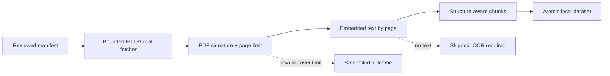

# EXTR-001: Digital-text PDF extraction

## Summary

| Field | Value |
|---|---|
| Phase ID | `EXTR-001` |
| Status | Complete |
| Depends on | `CORE-001`, `ADAPT-001`, `CLI-001`, `PIPE-001` |
| Scope | Provider-neutral, page-aware PDF extraction in `source process` |

This phase adds PDF as the first binary format in the manifest-driven pipeline. It extracts
embedded text in memory, preserves page identity, applies explicit byte/page/token bounds,
and does not invoke OCR or persist original PDF bytes.

## Background

`PIPE-001` intentionally supported only text, Markdown, HTML, XHTML, and XML. The legacy
scraper has a file-writing PDF/OCR workflow, but that implementation is coupled to resumable
unit directories and optional system binaries. The universal path needs an `Extractor`
adapter that consumes `FetchedArtifact` bytes and returns normalized `ExtractedDocument`
blocks without storage or provider assumptions.

## User story / use case

As an open-source user, I want a reviewed manifest containing digital-text PDFs to produce
local page-aware chunks, so I can inspect retrieval data without credentials, uploads, or
an OCR installation.

## Scope

### In scope

- PDFs identified by media type or `.pdf` filename/URI.
- Embedded-text extraction with `pdfminer.six`.
- Page-numbered normalized blocks and extraction metadata.
- Automatic selection by `source process` for local or HTTP fetched PDFs.
- Explicit fetched-byte, PDF-page, resource, and chunk-token bounds.
- Structured `ocr_required` skip outcome for PDFs with no extractable text.
- Safe failures for malformed, unreadable, encrypted, and over-limit PDFs.

### Out of scope

- OCR, image extraction, tables reconstructed from geometry, forms, annotations, and images.
- Password input or decryption workflows.
- DOC/DOCX, PPT/PPTX, XLS/XLSX, CSV, or other binary formats.
- Saving or redistributing original PDF files.
- Replacing the legacy scraper's resumable PDF/OCR workflow.

## System constraints

- The adapter implements the universal synchronous `Extractor` contract.
- Extraction operates on bounded bytes already returned by a configured fetcher.
- `DOC_HARVESTER_MAX_PDF_PAGES` / `--max-pdf-pages` defaults to `1000` and must be positive.
- No network, credentials, temporary source file, Poppler, or Tesseract is required.
- A dataset output directory remains atomic and must not already exist.

## Functional requirements

| ID | Requirement |
|---|---|
| `EXTR-001-FR-01` | Recognize PDF artifacts by standard PDF media type or `.pdf` location. |
| `EXTR-001-FR-02` | Reject content without a PDF signature before parsing. |
| `EXTR-001-FR-03` | Extract embedded text into normalized blocks with one-based page numbers. |
| `EXTR-001-FR-04` | Record page count, text-page count, empty pages, and OCR status in document metadata. |
| `EXTR-001-FR-05` | Stop and fail safely when a PDF exceeds the configured positive page limit. |
| `EXTR-001-FR-06` | Report a textless PDF as skipped with reason `ocr_required`. |
| `EXTR-001-FR-07` | Feed extracted PDF blocks through the existing structure-aware chunker and dataset writer. |
| `EXTR-001-FR-08` | Never persist the original PDF bytes in the processed dataset. |

## Layouts and diagrams

## API requirements

| ID | Requirement |
|---|---|
| `EXTR-001-API-01` | `PDFExtractor` is importable from `doc_harvester.extractors`. |
| `EXTR-001-API-02` | `available_extractors()` includes `pdf`; `create_extractor("pdf")` builds it. |
| `EXTR-001-API-03` | `select_extractor()` accepts a positive `max_pdf_pages` policy. |
| `EXTR-001-API-04` | `source process` exposes `--max-pdf-pages` with an environment-backed default. |
| `EXTR-001-API-05` | Existing version-1 document, chunk, and processing-report schemas remain compatible. |

## Non-functional requirements

| ID | Requirement |
|---|---|
| `EXTR-001-NFR-01` | Normal PDF extraction requires no external services or system OCR binaries. |
| `EXTR-001-NFR-02` | Parser exceptions are reduced to safe exception types in public outcomes. |
| `EXTR-001-NFR-03` | Tests use synthetic, redistribution-safe PDF fixtures and no network. |
| `EXTR-001-NFR-04` | Standalone, DocProc, package, lint, secret, and CI checks remain green. |

## Logging and monitoring

The existing processing report records the extractor, block/chunk counts, and outcome for
each resource. Textless PDFs use `reason: ocr_required`; malformed and over-limit files use
the existing sanitized failed outcome. No document text or parser internals are logged.

## Edge cases

- PDF media type with a misleading extension, or `.pdf` filename with generic media type.
- Leading whitespace, missing signature, truncated/corrupt structure, and encrypted files.
- Empty PDF, textless pages, a mix of text and empty pages, and a wholly image-only PDF.
- Exactly-at-limit and over-limit page counts.
- Non-ASCII text, unusual font encodings, CID artifacts, and reading-order ambiguity.
- A PDF succeeds while another manifest resource skips or fails.

## Acceptance criteria

| ID | Criterion | Verification |
|---|---|---|
| `EXTR-001-AC-01` | A two-page digital PDF produces page-numbered normalized blocks and chunks. | `EXTR-001-TC-01`; automated integration test |
| `EXTR-001-AC-02` | A textless PDF produces a structured `ocr_required` outcome without OCR execution. | `EXTR-001-TC-02`; automated test |
| `EXTR-001-AC-03` | Invalid and over-limit PDFs fail safely without partial document artifacts. | `EXTR-001-TC-03`; automated tests |
| `EXTR-001-AC-04` | Factories, CLI, configuration, and public documentation expose PDF support and its limits. | `EXTR-001-TC-04`; configuration tests |
| `EXTR-001-AC-05` | Complete regression, package, security, and CI validation passes. | `EXTR-001-TC-05` |

## Decisions and open questions

| Status | Decision | Reason |
|---|---|---|
| Decided | Digital text precedes OCR. | Keeps the universal adapter portable, deterministic, and credential-free. |
| Decided | Textless PDFs are skipped, not decoded or silently accepted. | Makes the missing capability explicit in the report. |
| Decided | Original bytes remain transient. | Reduces redistribution/privacy risk and output size. |
| Deferred | OCR engine selection and resource controls. | Requires system/runtime policy and substantially different testing. |
| Deferred | Layout/table reconstruction. | Requires a separate quality contract and fixtures. |

## Implementation outcome

Implemented:

- Public in-memory `PDFExtractor` with media/extension selection and safe signature checks.
- Page-aware embedded-text blocks plus page/empty-page/OCR metadata.
- Positive configurable PDF page bound wired through the processing API, CLI, and environment.
- Structured `ocr_required` processing outcome without invoking external OCR tools.
- Synthetic fixture, unit/integration/boundary tests, and public operational documentation.

Local verification on 2026-08-04:

- Focused PDF/processing/source/configuration suite: 52 passed.
- Complete standalone suite: 160 passed.
- Complete DocProc suite: 107 passed.
- Ruff, diff validation, wheel build/contents/import/extraction, installed CLI help, and
  complete-history/public-tree Gitleaks scans passed.
- PR #13 standalone Python 3.11/3.12, DocProc, secrets, and CodeQL checks passed.
