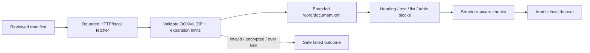

# EXTR-002: Structure-aware DOCX extraction

## Summary

| Field | Value |
|---|---|
| Phase ID | `EXTR-002` |
| Status | Complete |
| Depends on | `CORE-001`, `PIPE-001`, `EXTR-001` |
| Scope | Safe, provider-neutral DOCX main-body extraction in `source process` |

This phase adds DOCX as the second binary format in the manifest-driven pipeline. It reads
the OOXML container in memory using the Python standard library, preserves headings,
sections, lists, and table rows, and applies explicit archive-expansion and block bounds.

## Background

DOCX is a ZIP-based Open Packaging Convention document. The independent DocProc service
can process Office files through Docling, but the lightweight public pipeline should not
require that service or its model-heavy dependency tree. A focused OOXML adapter covers
the common retrieval use case while keeping the universal core synchronous, local, and
credential-free.

## User story / use case

As an open-source user, I want reviewed DOCX files in a source manifest to produce
structure-aware local chunks, so headings, lists, and tables remain useful for retrieval
without running DocProc or installing Microsoft Office.

## Scope

### In scope

- DOCX recognition by standard media type or `.docx` filename/URI.
- Main `word/document.xml` body extraction in source order.
- Heading/style-based sections, ordinary paragraphs, numbered/bulleted items, and tables.
- One normalized block per paragraph/list item/table row.
- Archive entry, expanded-byte, main-XML-byte, and output-block safeguards.
- Automatic local/HTTP manifest processing and structure-aware chunking.
- Synthetic offline fixtures and version-1 dataset compatibility.

### Out of scope

- Legacy `.doc`, password-protected/encrypted files, macros, and template formats.
- PPT/PPTX, XLS/XLSX, CSV, PDF OCR, and images.
- Headers, footers, footnotes, endnotes, comments, text boxes, equations, drawings, and
  tracked-deletion recovery.
- Visual pagination, exact Word rendering, merged-cell reconstruction, and style fidelity.
- Saving or redistributing original DOCX files.

## System constraints

- Extraction uses `zipfile` and `xml.etree.ElementTree`; no new runtime package is added.
- Only named OOXML parts are read; archive contents are never extracted to disk.
- Required `[Content_Types].xml` and unique `word/document.xml` parts must exist.
- XML containing DTD/entity declarations is rejected before parsing.
- Default limits are 2,000 entries, 100 MiB expanded archive content, 20 MiB main XML,
  and 10,000 normalized blocks.
- Flow-layout DOCX has no reliable page numbers without rendering; document/chunk page
  metadata remains `null` rather than inventing pages.

## Functional requirements

| ID | Requirement |
|---|---|
| `EXTR-002-FR-01` | Recognize DOCX by media type or `.docx` location and validate its ZIP/OOXML structure. |
| `EXTR-002-FR-02` | Extract main-body elements in document order without writing source files. |
| `EXTR-002-FR-03` | Classify styled headings, paragraphs, and numbered/bulleted list items. |
| `EXTR-002-FR-04` | Convert each non-empty table row to a pipe-delimited table block with row metadata. |
| `EXTR-002-FR-05` | Propagate section and block-kind information through chunking. |
| `EXTR-002-FR-06` | Record block/paragraph/heading/list/table counts in document metadata. |
| `EXTR-002-FR-07` | Reject encrypted, malformed, entity-bearing, duplicate-main-part, or incomplete containers safely. |
| `EXTR-002-FR-08` | Enforce configured positive block and expanded-byte bounds plus fixed entry/XML bounds. |
| `EXTR-002-FR-09` | Process valid DOCX resources through the existing atomic version-1 dataset path. |

## Layouts and diagrams

## API requirements

| ID | Requirement |
|---|---|
| `EXTR-002-API-01` | `DOCXExtractor` is importable from `doc_harvester.extractors`. |
| `EXTR-002-API-02` | `available_extractors()` includes `docx`; `create_extractor("docx")` builds it. |
| `EXTR-002-API-03` | `select_extractor()` accepts DOCX block and expanded-byte policies. |
| `EXTR-002-API-04` | `source process` exposes `--max-docx-blocks` and `--max-docx-uncompressed-bytes`. |
| `EXTR-002-API-05` | Equivalent environment defaults are documented in the universal root template. |
| `EXTR-002-API-06` | Version-1 report/document/chunk schemas remain backward compatible. |

## Non-functional requirements

| ID | Requirement |
|---|---|
| `EXTR-002-NFR-01` | Normal extraction requires no network, credentials, Office installation, or new dependency. |
| `EXTR-002-NFR-02` | Archive data is never expanded onto the filesystem. |
| `EXTR-002-NFR-03` | Parser failures expose safe exception types/messages rather than XML/source content. |
| `EXTR-002-NFR-04` | Synthetic fixtures cover positive, malformed, XML, entry, byte, and block boundaries offline. |
| `EXTR-002-NFR-05` | Standalone, DocProc, wheel, lint, secrets, and CodeQL checks remain green. |

## Logging and monitoring

The existing processing report records processed/skipped/failed state and DOCX block/chunk
counts. Document metadata records structural counts. Parser XML, document text, and archive
member content are not logged. Failures retain only controlled validation messages or the
exception class already used by `source process`.

## Edge cases

- Correct media type without extension and `.docx` with generic media type.
- A non-ZIP payload, corrupt central directory, absent required parts, or duplicate main part.
- Encrypted members, excessive member count, deceptive compression, and oversized main XML.
- Empty paragraphs, empty table cells/rows, nested paragraphs in table cells, and pipe text.
- Heading styles such as `Heading1`, `Title`, and `Subtitle`; lists beneath a section.
- Mixed supported/unsupported/failing resources and a document with no useful body blocks.
- Hyperlink-contained runs, line breaks, tabs, split runs, and non-ASCII text.

## Acceptance criteria

| ID | Criterion | Verification |
|---|---|---|
| `EXTR-002-AC-01` | A DOCX containing heading, paragraph, list, and table produces ordered typed blocks and chunks. | `EXTR-002-TC-01`; automated tests |
| `EXTR-002-AC-02` | Sections and table classification survive the chunker; unavailable page values remain null. | `EXTR-002-TC-02`; adapter test |
| `EXTR-002-AC-03` | Malformed/unsafe/over-limit containers fail safely without document artifacts. | `EXTR-002-TC-03`; boundary tests |
| `EXTR-002-AC-04` | Factories, CLI, `.env.example`, and docs expose DOCX and its bounds. | `EXTR-002-TC-04`; configuration tests |
| `EXTR-002-AC-05` | Full regression, package, secret, PR, and post-merge validation passes. | `EXTR-002-TC-05` |

## Decisions and open questions

| Status | Decision | Reason |
|---|---|---|
| Decided | Parse minimal OOXML directly. | Avoids a heavy dependency while covering common retrieval structure. |
| Decided | Preserve logical structure, not visual layout. | Exact Word pagination/rendering requires a different engine. |
| Decided | Return null page metadata. | Invented page numbers are misleading for flow-layout documents. |
| Decided | Do not extract archive members to disk. | Reduces traversal, cleanup, and data-retention risk. |
| Deferred | Headers, notes, drawings, equations, and tracked-change policy. | Need separate content and privacy decisions. |
| Deferred | Legacy `.doc` conversion. | Requires an external conversion runtime. |

## Implementation outcome

Implemented:

- Public dependency-free `DOCXExtractor` for Transitional and Strict OOXML documents.
- Ordered headings, paragraphs, list items, and pipe-delimited table-row blocks.
- Section and block-kind propagation through structure-aware chunking with null page metadata.
- Entry, expanded-archive, main-XML, entity-declaration, required-part, and block safeguards.
- Environment/CLI bounds plus atomic manifest-processing integration.
- Synthetic structure/security fixtures, automated coverage, and public phase documentation.

Local verification on 2026-08-04:

- Focused DOCX/PDF/processing/source/configuration suite: 64 passed.
- Complete standalone suite: 172 passed.
- Complete DocProc suite: 107 passed.
- Ruff, diff validation, wheel build/contents/import/extraction, installed CLI help, and
  complete-history/public-tree Gitleaks scans passed.
- PR #14 standalone Python 3.11/3.12, DocProc, secrets, and CodeQL checks passed.
