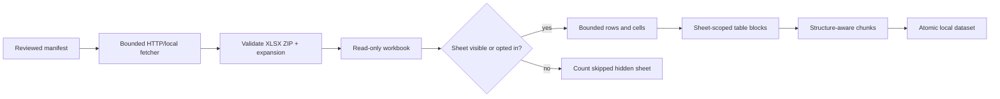

# EXTR-003: Bounded XLSX extraction

## Summary

| Field | Value |
|---|---|
| Phase ID | `EXTR-003` |
| Status | Complete |
| Depends on | `CORE-001`, `PIPE-001`, `EXTR-001`, `EXTR-002` |
| Scope | Streaming, sheet-aware XLSX extraction in `source process` |

This phase adds XLSX as the third binary format in the manifest-driven pipeline. It streams
worksheet rows with `openpyxl`, preserves sheet/row/table structure and formulas as text,
excludes hidden worksheets by default, and enforces archive, sheet, row, and cell limits.

## Background

Spreadsheets can contain very large sparse dimensions, compressed XML, formulas, and hidden
worksheets. The independent DocProc service has a domain-specialized Excel parser, while
the public pipeline needs a neutral adapter that produces stable retrieval blocks without
classifying electrical-estimate columns or requiring external services.

## User story / use case

As an open-source user, I want reviewed XLSX workbooks in a source manifest to produce
sheet-scoped table chunks, so catalogues and tabular documentation can be inspected locally
without evaluating formulas, exposing hidden content by default, or uploading source files.

## Scope

### In scope

- XLSX recognition by standard media type or `.xlsx` filename/URI.
- Read-only streaming of ordinary worksheets in workbook order.
- One pipe-delimited table block per non-empty row with stable source-row metadata.
- Strings, numbers, booleans, dates/times, error values, and formula expressions.
- Sheet names as sections and visible/hidden state as opted-in row metadata.
- Hidden/very-hidden worksheets excluded by default with an explicit CLI opt-in.
- ZIP entry/expanded-byte plus worksheet/row/cell safeguards.
- Existing structure-aware chunks and atomic version-1 dataset output.

### Out of scope

- Legacy `.xls`, macro-enabled `.xlsm`, CSV/TSV, XLSB, ODS, and encrypted workbooks.
- Formula calculation, cached-result reconciliation, recalculation engines, or external links.
- Chartsheets, charts, images, comments, notes, shapes, pivot-cache content, and VBA.
- Visual formatting, colors, conditional formatting, merged-cell reconstruction, or print pages.
- Domain-specific header detection, row classification, or semantic column mapping.
- Saving or redistributing original workbook bytes.

## System constraints

- `openpyxl` is already a standalone runtime dependency and is used in read-only mode.
- Formula text is retained with `data_only=False`; formulas are never executed or recalculated.
- External workbook links are not retained by the loader.
- Archive members are inspected but never extracted onto the filesystem.
- Default limits: 100 worksheets, 200,000 inspected rows, 2,000,000 inspected cells,
  5,000 archive entries, and 250 MiB total expanded content.
- Declared worksheet dimensions are checked before iteration to prevent oversized row tuples.
- Spreadsheet layout has no page model; chunk page values remain `null`.

## Functional requirements

| ID | Requirement |
|---|---|
| `EXTR-003-FR-01` | Recognize XLSX by media type or extension and validate required OOXML parts. |
| `EXTR-003-FR-02` | Stream visible worksheets and rows in workbook/source order. |
| `EXTR-003-FR-03` | Render each non-empty row as an escaped pipe-delimited table block. |
| `EXTR-003-FR-04` | Preserve sheet title/index/state, source row, column/non-empty/formula counts. |
| `EXTR-003-FR-05` | Render booleans and date/time values deterministically and retain formulas as text. |
| `EXTR-003-FR-06` | Exclude hidden and very-hidden sheets by default without recording their titles. |
| `EXTR-003-FR-07` | Allow explicit inclusion of hidden sheets through processing API/CLI policy. |
| `EXTR-003-FR-08` | Enforce positive sheet, row, cell, entry, and expanded-byte limits. |
| `EXTR-003-FR-09` | Propagate sheet/table structure through chunking with null page metadata. |
| `EXTR-003-FR-10` | Process valid XLSX resources through atomic version-1 dataset publication. |

## Layouts and diagrams

## API requirements

| ID | Requirement |
|---|---|
| `EXTR-003-API-01` | `XLSXExtractor` is importable from `doc_harvester.extractors`. |
| `EXTR-003-API-02` | `available_extractors()` includes `xlsx`; `create_extractor("xlsx")` builds it. |
| `EXTR-003-API-03` | `select_extractor()` accepts sheet/row/cell/expanded-byte and hidden-sheet policies. |
| `EXTR-003-API-04` | `source process` exposes matching positive bounds and a Boolean hidden-sheet option. |
| `EXTR-003-API-05` | `.env.example` contains safe environment defaults with hidden inclusion disabled. |
| `EXTR-003-API-06` | Version-1 report/document/chunk schemas remain backward compatible. |

## Non-functional requirements

| ID | Requirement |
|---|---|
| `EXTR-003-NFR-01` | Extraction performs no network calls, formula execution, or source-file writes. |
| `EXTR-003-NFR-02` | Workbook rows are streamed rather than materialized as a full workbook matrix. |
| `EXTR-003-NFR-03` | Hidden content is privacy-safe by default and skipped titles are not persisted. |
| `EXTR-003-NFR-04` | Malformed/parser failures expose controlled messages or exception classes only. |
| `EXTR-003-NFR-05` | Offline fixtures cover types, formulas, hidden sheets, malformed files, and bounds. |
| `EXTR-003-NFR-06` | Standalone, DocProc, package, lint, secret, and CodeQL checks remain green. |

## Logging and monitoring

The processing report uses existing resource outcomes and block/chunk counts. Document
metadata records total/processed sheet counts, skipped-hidden count, inspected/non-empty
rows, inspected cells, blocks, and formulas. Hidden sheet titles, cell contents, formula
text, and parser details are not logged separately.

## Edge cases

- Standard media type without extension and `.xlsx` with generic media type.
- Invalid ZIP, missing/duplicate workbook parts, encryption, excessive entries/expansion.
- Sparse or misleading declared dimensions, blank rows, leading/trailing empty cells.
- Hidden and very-hidden sheets, hidden-only useful data, and explicit opt-in.
- Multiple worksheets, empty worksheets, Unicode sheet names, and pipe characters.
- Formula cells, error cells, booleans, dates/times, numeric zero, and long values.
- Exactly-at-limit versus over-limit sheets/rows/cells and mixed manifest outcomes.

## Acceptance criteria

| ID | Criterion | Verification |
|---|---|---|
| `EXTR-003-AC-01` | A typed/formula workbook produces ordered sheet-scoped table blocks and chunks. | `EXTR-003-TC-01`; automated tests |
| `EXTR-003-AC-02` | Hidden sheets are excluded by default without title leakage and included only by opt-in. | `EXTR-003-TC-02`; automated tests |
| `EXTR-003-AC-03` | Unsafe/over-limit workbooks fail safely without partial document artifacts. | `EXTR-003-TC-03`; boundary tests |
| `EXTR-003-AC-04` | Factories, CLI, `.env.example`, and documentation expose XLSX policies. | `EXTR-003-TC-04`; config tests |
| `EXTR-003-AC-05` | Full regression, package, secret, PR, and post-merge validation passes. | `EXTR-003-TC-05` |

## Decisions and open questions

| Status | Decision | Reason |
|---|---|---|
| Decided | Retain formulas as expressions and never calculate them. | Deterministic, safe behavior without an Excel engine. |
| Decided | Exclude hidden sheets by default and retain only their count. | Reduces accidental confidential-content and title disclosure. |
| Decided | Use generic row blocks, not domain-specific semantic mapping. | Keeps the adapter universal. |
| Decided | Check declared dimensions before streaming. | Prevents oversized allocations from malicious/sparse dimensions. |
| Deferred | CSV/TSV support. | Needs encoding, delimiter, and formula-injection policies. |
| Deferred | Legacy XLS and macro-enabled formats. | Need separate dependencies and security boundaries. |

## Implementation outcome

Implemented:

- Public read-only `XLSXExtractor` with automatic media/extension selection.
- Ordered sheet-scoped table rows with deterministic value and formula rendering.
- Privacy-safe hidden-sheet exclusion with explicit API/CLI/environment opt-in.
- Archive entry/expansion and pre-iteration sheet/row/cell dimension safeguards.
- Table/section propagation through chunking with null spreadsheet page metadata.
- Synthetic type/privacy/boundary fixtures, manifest integration, and public documentation.

Local verification on 2026-08-04:

- Focused XLSX/DOCX/PDF/processing/source/configuration suite: 79 passed.
- Complete standalone suite: 187 passed.
- Complete DocProc suite: 107 passed.
- Ruff, diff validation, wheel build/contents/import/extraction/chunking, installed CLI help,
  and complete-history/public-tree Gitleaks scans passed.
- PR #15 standalone Python 3.11/3.12, DocProc, secrets, and CodeQL checks passed.
