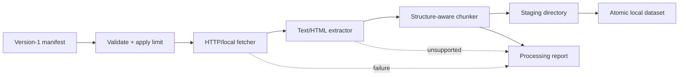

# PIPE-001: Manifest-driven local processing

## Phase metadata

| Field | Value |
|---|---|
| Phase ID | `PIPE-001` |
| Status | Complete |
| Owner | Repository maintainer |
| Started | 2026-08-04 |
| Completed | 2026-08-04 |
| Component | Extractors, chunkers, source CLI orchestration |
| Related issue / PR | [#12](https://github.com/getanotherone/doc-harvester/pull/12) |
| Manual tests | [manual-test-cases.md](manual-test-cases.md) |
| Operator documentation | [Configuration](../../configuration.md), [Providers](../../providers.md) |

## Summary

Consume a version-1 source manifest, fetch each selected local or HTTP resource, extract
supported text content, apply bounded structure-aware chunking, and atomically publish a
reviewable local dataset directory. This is the first universal discovery-to-processing
path that does not depend on the legacy scraper or a provider account.

## Background

`CLI-001` can create resource manifests and fetch one reviewed resource, but users still
need custom Python or legacy domain-specific commands to produce chunks. The next safe
increment connects universal manifests, fetchers, extractors, and chunkers while keeping
all output local and avoiding complex PDF/office parsing requirements.

## User story / use case

As an open-source user, I want to turn a reviewed source manifest into local normalized
documents and chunks, so that I can inspect retrieval data before adding storage,
publication, embeddings, or provider credentials.

## Scope

### In scope

- Version-1 manifest loading and validation.
- Automatic HTTP/local fetcher selection for mixed-resource manifests.
- Plain text, Markdown, HTML, XHTML, and XML extraction.
- Structure-aware chunking with a positive absolute token bound.
- Per-document normalized block and chunk JSON artifacts.
- A processing report with processed, skipped, and failed outcomes.
- Atomic publication to a new output directory only.
- CLI/environment bounds and offline automated coverage.

### Out of scope

- PDF/OCR, DOCX/PPTX, spreadsheet/CSV, images, and legacy binary formats.
- HTML link crawling, JavaScript rendering, retries, resume/checkpointing, or concurrency.
- Saving original downloaded bytes.
- Metadata enrichment, quality-gate policy, embeddings, storage upload, or publishing.
- Replacing an existing output directory.

## System constraints

- Input must be a regular UTF-8 JSON file with `schema_version: 1` and consistent count.
- Output must not already exist and is exposed only after all report files are complete.
- Resource fetches inherit root, byte, timeout, credential, and scheme protections.
- Unsupported formats are skipped explicitly rather than decoded as arbitrary text.
- A resource failure does not discard other successful document results.
- The command returns non-zero when any resource fails or no document is processed.

## Functional requirements

| ID | Requirement |
|---|---|
| `PIPE-001-FR-01` | Load and validate a version-1 manifest with provider, count, and resource objects. |
| `PIPE-001-FR-02` | Process no more than the positive CLI/environment resource limit. |
| `PIPE-001-FR-03` | Infer HTTP or local-file fetching per resource and preserve adapter safety bounds. |
| `PIPE-001-FR-04` | Select a text or HTML-family extractor only when media type or filename is supported. |
| `PIPE-001-FR-05` | Convert extracted content into universal documents/blocks and bounded structure-aware chunks. |
| `PIPE-001-FR-06` | Write one normalized document and chunk file per processed resource plus one report. |
| `PIPE-001-FR-07` | Record unsupported resources as skipped and adapter/extraction errors as failed. |
| `PIPE-001-FR-08` | Publish the complete dataset atomically to a new explicit output directory. |

## Layouts and diagrams



Output layout:

```text
output/
├── processing-report.json
└── documents/
    ├── 00000/
    │   ├── document.json
    │   └── chunks.json
    └── 00001/
        ├── document.json
        └── chunks.json
```

## API requirements

| ID | Requirement |
|---|---|
| `PIPE-001-API-01` | Public extractor adapters import from `doc_harvester.extractors`. |
| `PIPE-001-API-02` | Public chunker adapters import from `doc_harvester.chunkers`. |
| `PIPE-001-API-03` | Concrete adapters implement the universal `Extractor` and `Chunker` contracts. |
| `PIPE-001-API-04` | `source process` requires manifest and output arguments and exposes positive limit/byte/timeout/token controls. |
| `PIPE-001-API-05` | Dataset, document, chunk, and report JSON use `schema_version: 1`. |

## Data requirements

- The source manifest is treated as potentially sensitive because URIs may contain queries.
- `document.json` contains the resource, extractor, filename, media type, and normalized blocks.
- `chunks.json` contains document identity, stable indices, text, and structure metadata.
- `processing-report.json` contains only sanitized adapter error messages and relative artifact paths.
- Original bytes are not persisted by this phase.

## Non-functional requirements

| ID | Requirement |
|---|---|
| `PIPE-001-NFR-01` | Local output publication is atomic and never replaces an existing directory. |
| `PIPE-001-NFR-02` | Fetch, manifest count, and chunk token bounds are explicit and validated. |
| `PIPE-001-NFR-03` | The complete happy path and mixed-result behavior are testable without external network access. |
| `PIPE-001-NFR-04` | Existing CLI behavior and standalone/DocProc suites remain compatible. |
| `PIPE-001-NFR-05` | New adapter packages and command code are included in the wheel. |

## Logging and monitoring

The command emits a JSON summary and persists a detailed processing report. It adds no
remote telemetry. Each resource records `processed`, `skipped`, or `failed`; failures use
the sanitized adapter message or exception type without raw upstream response content.

## Security and privacy

- Fetcher credential, scheme, path, origin, byte, and timeout protections remain active.
- Output requires a new explicit directory and is staged in the same parent filesystem.
- Original fetched bytes are held only for processing and are not saved.
- Manifest and document metadata may preserve source query parameters and require review
  before public sharing.

## Edge cases

- Missing/malformed JSON, wrong schema version, mismatched count, empty resources, invalid
  resource objects, or an existing output path.
- Mixed local/HTTP resources, unsupported schemes, unavailable files, oversized content,
  empty content, invalid UTF-8, and unsupported media/extension combinations.
- HTML with only navigation, XML without useful text, empty extracted blocks, protected
  table/normative blocks, and text larger than the chunk maximum.
- Some documents processed while others skip/fail.

## Risks and mitigations

| Risk | Impact | Mitigation |
|---|---|---|
| Users assume every advertised document type is supported | High | Explicit supported list and structured skipped outcomes. |
| Partial processing leaves an apparently complete dataset | High | Stage beside destination and rename only after report/artifacts finish. |
| One bad source loses successful work | Medium | Isolate per-resource errors and publish a mixed-result report. |
| Large output consumes memory/disk | Medium | Bound input bytes/resources/tokens and defer originals/batch concurrency. |

## Rollout, migration, and rollback

1. Publish additive extractor/chunker packages and `source process`.
2. Verify local and injected HTTP manifests, mixed outcomes, wheel contents, and full CI.
3. Add format-specific binary adapters in later independently documented phases.

No migration or external state change is required. Rollback is a normal code revert.

## Acceptance criteria

| ID | Criterion | Verification |
|---|---|---|
| `PIPE-001-AC-01` | A valid local text/HTML manifest produces normalized document/chunk artifacts and report. | `PIPE-001-TC-01`; processing tests |
| `PIPE-001-AC-02` | Mixed manifests use HTTP/local fetching and preserve processed/skipped/failed outcomes. | `PIPE-001-TC-02`; injected-fetch tests |
| `PIPE-001-AC-03` | Invalid manifests/settings/output paths fail without publishing partial output. | `PIPE-001-TC-03`; negative tests |
| `PIPE-001-AC-04` | Chunks respect the configured maximum except explicitly protected oversized structures. | `PIPE-001-TC-04`; chunker tests |
| `PIPE-001-AC-05` | Full regression, wheel, secret, CI, and CodeQL checks pass. | `PIPE-001-TC-05`; CI |

## Implementation outcome

Implemented:

- Public neutral text/Markdown and static HTML/XHTML/XML extractor adapters.
- Public structure-aware chunker adapter with explicit oversized metadata.
- Strict bounded manifest loader and mixed-resource processing orchestrator.
- Atomic new-directory dataset publication with normalized documents, chunks, and report.
- Additive `source process` command and environment-backed bounds.
- Public configuration, provider, architecture, README, task, and manual-test documentation.

Local verification:

- Focused processing/source/configuration suite: 43 passed.
- Complete standalone suite: 151 passed.
- Complete DocProc suite: 107 passed.
- Ruff, diff validation, wheel contents/import, artifact CLI processing smoke test, and
  Gitleaks complete-history/public-tree scans passed.
- Real local Markdown/HTML manifest processed two documents into 20 chunks with a complete
  report and expected dataset layout.
- PR #12 standalone 3.11/3.12, DocProc, secrets, and CodeQL checks passed.

## Decisions and open questions

| Status | Question or decision | Reason / owner |
|---|---|---|
| Decided | Do not persist original fetched bytes. | Reduces redistribution/privacy risk and output size. |
| Decided | Output must be a new directory. | Avoids ambiguous destructive merge/overwrite behavior. |
| Decided | Start with text/HTML/XML. | Binary formats need separate parser and OCR constraints. |
| Deferred | Manifest resume, concurrency, retries, and quality/enrichment. | Require independent operational policies. |
