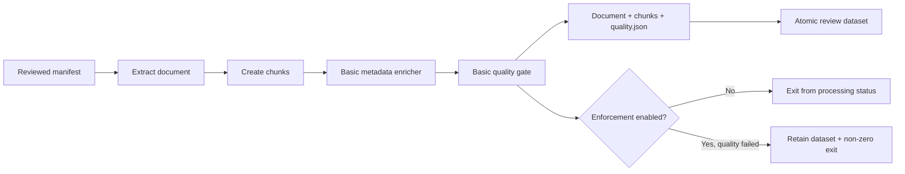

# PIPE-002: Neutral enrichment and quality gates

## Summary

| Field | Value |
|---|---|
| Phase ID | `PIPE-002` |
| Status | Complete |
| Depends on | `CORE-001`, `PIPE-001`, `EXTR-001`, `EXTR-002`, `EXTR-003` |
| Scope | Provider-neutral metadata enrichment and quality evaluation in `source process` |

This phase connects the universal `MetadataEnricher` and `QualityGate` contracts to the
manifest processing path. Each processed document and its chunks receive neutral metadata,
and each document receives a reviewable quality report. Quality is advisory by default and
can be enforced through an explicit CLI or environment policy.

## Background

The universal core already defined stable enrichment and quality contracts, but the public
manifest pipeline stopped after chunking. The legacy scraper contains useful quality-ratio
ideas alongside electrical-domain classification. Reusing the ratios while excluding
vendor, document-type, and electrical assumptions gives open-source users a predictable
baseline without coupling the core path to the original project domain.

## User story / use case

As an open-source user, I want every processed document to contain consistent technical
metadata and an explainable quality result, so I can review weak extraction locally and
choose whether quality findings should merely warn or fail an automated run.

## System constraints

- Enrichment must not infer organization, vendor, product domain, or electrical document type.
- Hashes are SHA-256 fingerprints of normalized extracted content, not authentication data.
- Quality evaluation uses extracted chunks only and performs no network or model calls.
- Ratio thresholds are inclusive limits between `0` and `1`; minimum tokens is positive.
- A quality failure must not discard a complete, reviewable dataset.
- Existing version-1 document, chunk, dataset, and processing-report schemas remain additive.

## Functional requirements

| ID | Requirement |
|---|---|
| `PIPE-002-FR-01` | Enrich each processed document with enricher name, source type, language, structural class, counts, and content SHA-256. |
| `PIPE-002-FR-02` | Enrich every chunk with matching neutral metadata, document language, and a normalized content SHA-256. |
| `PIPE-002-FR-03` | Evaluate empty, tiny, duplicate, noisy, and oversized chunk ratios against configured limits. |
| `PIPE-002-FR-04` | Write one version-1 `quality.json` beside each processed document and chunk artifact. |
| `PIPE-002-FR-05` | Add `quality_status` to enriched document/chunk metadata and quality fields to resource/report outcomes. |
| `PIPE-002-FR-06` | Keep quality findings report-only by default and return zero when processing otherwise succeeds. |
| `PIPE-002-FR-07` | With enforcement enabled, retain the dataset and return non-zero if any document fails quality. |
| `PIPE-002-FR-08` | Reject invalid minimum-token or ratio settings before processing. |

## Layouts and diagrams

## API requirements

| ID | Requirement |
|---|---|
| `PIPE-002-API-01` | `BasicMetadataEnricher`, its factory, and available-name function are importable from `doc_harvester.enrichers`. |
| `PIPE-002-API-02` | `BasicQualityGate`, its factory, and available-name function are importable from `doc_harvester.quality`. |
| `PIPE-002-API-03` | Both concrete adapters implement the universal core contracts. |
| `PIPE-002-API-04` | `process_manifest` permits injected enrichers/gates and exposes threshold/enforcement policies. |
| `PIPE-002-API-05` | `source process` exposes matching CLI flags backed by `DOC_HARVESTER_*` environment variables. |
| `PIPE-002-API-06` | The standalone wheel includes both new public packages. |

## Non-functional requirements

| ID | Requirement |
|---|---|
| `PIPE-002-NFR-01` | Evaluation is deterministic, offline, and provider neutral. |
| `PIPE-002-NFR-02` | Findings contain stable codes and metrics without copying full chunk content. |
| `PIPE-002-NFR-03` | Quality output is written within the existing atomic dataset staging boundary. |
| `PIPE-002-NFR-04` | Existing extraction, CLI, standalone, and DocProc behavior remains compatible. |
| `PIPE-002-NFR-05` | Lint, package, secret, CI, and CodeQL checks remain green. |

## Logging and monitoring

`processing-report.json` records the selected enricher and gate, per-resource
`quality_passed`, total `quality_failed_count`, and whether enforcement was enabled.
`quality.json` contains status, findings, aggregate metrics, and thresholds. It does not
contain source bytes or reproduce chunk bodies. CLI summary output exposes the failed count
and enforcement policy for automation logs.

## Edge cases

- No document or no chunks.
- Empty/whitespace-only chunks and a document composed mostly of tiny chunks.
- Exact normalized duplicate text with different whitespace or case.
- OCR-like CID/replacement-character noise and symbol-heavy content.
- Table chunks containing many symbols but valid structured data.
- Long protected or unpunctuated input that must split at the absolute token limit.
- Ratios exactly at the configured limit versus above it.
- Mixed manifests where quality fails, extraction fails, or both occur.
- Report-only and enforced execution using the same inputs and retained output.

## Acceptance criteria

| ID | Criterion | Verification |
|---|---|---|
| `PIPE-002-AC-01` | Processed documents/chunks contain only neutral baseline enrichment fields. | `PIPE-002-TC-01`; enrichment tests |
| `PIPE-002-AC-02` | Quality reports identify all five configured problem classes with stable metrics/findings. | `PIPE-002-TC-02`; gate tests |
| `PIPE-002-AC-03` | Default quality failures remain reviewable and do not fail an otherwise successful command. | `PIPE-002-TC-03`; processing/CLI tests |
| `PIPE-002-AC-04` | Enforcement returns non-zero while preserving document, chunk, quality, and report artifacts. | `PIPE-002-TC-04`; CLI integration test |
| `PIPE-002-AC-05` | Public factories, environment defaults, ratio validation, and wheel contents are correct. | `PIPE-002-TC-05`; API/config/package checks |
| `PIPE-002-AC-06` | Full regression, secret, PR, and post-merge checks pass. | `PIPE-002-TC-06` |

## Decisions and open questions

| Status | Decision | Reason |
|---|---|---|
| Decided | Provide one `basic` enricher and gate behind public factories. | Establishes useful defaults while preserving replaceable contracts. |
| Decided | Keep quality advisory by default. | Early quality heuristics need human review and should not unexpectedly break users. |
| Decided | Preserve review artifacts in enforced mode. | Failed automation still needs evidence for diagnosis. |
| Decided | Exclude legacy electrical classification. | The public path must remain universal. |
| Deferred | Per-format threshold profiles. | Requires evidence from broader real-world corpora. |
| Deferred | Learned language detection or semantic quality scoring. | Would add dependencies, cost, and nondeterminism. |

## Implementation outcome

Implemented:

- Public neutral `basic` metadata enricher and factory.
- Public deterministic `basic` quality gate and factory.
- Enrich/evaluate stages in manifest processing with a per-document quality artifact.
- Report-only default and explicit fail-on-quality CLI/environment policy.
- Boundary, behavior, integration, configuration, and packaging coverage.

Local verification on 2026-08-05:

- Focused enrichment/quality/processing/source/configuration suite: 79 passed.
- Complete standalone suite: 209 passed.
- Complete DocProc suite: 107 passed.
- Ruff, diff validation, wheel build/contents, isolated installed-wheel enrichment/quality
  smoke, complete-history Gitleaks (40 commits), and staged public-tree Gitleaks passed.

- PR #16 standalone Python 3.11/3.12, DocProc, secrets, and CodeQL checks passed on
  implementation commit `b4b8fd4`.

PR #16 was squash-merged as `6d8c8bf`; subsequent full regression and E2E release checks
continue to cover enrichment and quality behavior.
