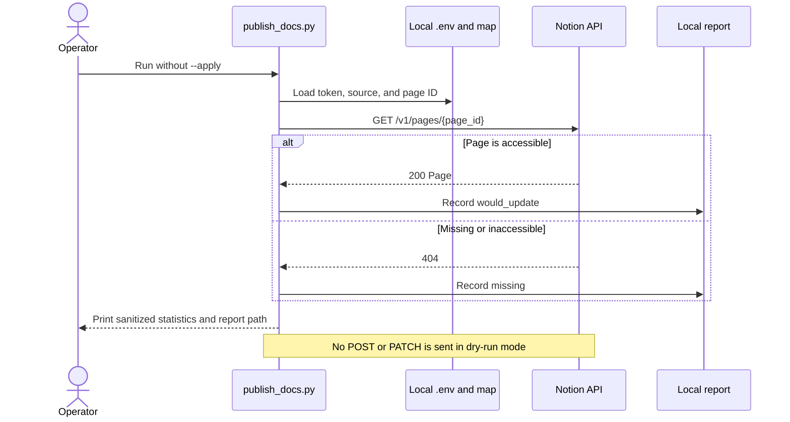

# PUB-001: Notion Publishing Connection and Validation

## Phase metadata

| Field | Value |
|---|---|
| Phase ID | `PUB-001` |
| Status | In validation |
| Started | 2026-07-15 |
| Component | Documentation publishers / Notion |
| Related implementation | Commit `96405b9`, PR #5 |
| Manual tests | [manual-test-cases.md](manual-test-cases.md) |
| Operator guide | [Notion dry-run guide](../../notion-dry-run.md) |

## Summary

Validate the provider-neutral documentation publishing workflow against a real Notion
workspace. The phase proves that a contributor can configure a least-privilege Notion
connection, safely resolve an existing page in dry-run mode, understand the generated
report, and deliberately opt into update or child-page creation behavior.

The Notion adapter and automated contract tests were implemented before this live
validation phase. On 2026-07-15, a real dry run completed with `status=would_update`, no
reported error, and no remote write. Real update and creation tests remain unexecuted.

## Background

`doc-harvester` originally published documentation locally and to Yandex Wiki. The
publisher layer was generalized so Confluence, Notion, and third-party services use the
same `Publisher.publish(..., dry_run, create_missing)` contract. Confluence could not be
validated during this phase because no test workspace was available, so Notion was chosen
for the first live provider validation.

Notion credentials and destination IDs are intentionally local. The committed repository
contains an operator guide and synthetic examples, while `.env`, the real publish map, and
raw execution reports remain ignored by Git.

## User story / use case

As a documentation maintainer, I want to preview publication of a local Markdown file to a
Notion page before enabling writes, so that I can verify credentials and page access
without accidentally changing remote documentation.

Secondary use cases:

- update an existing Notion page only after an explicit apply action;
- create a child page only after explicit apply and create-missing actions;
- diagnose missing credentials, malformed configuration, and insufficient permissions;
- reuse the same batch workflow for other publisher providers.

## Scope

### In scope

- Access-token authentication for a local trusted script.
- Least-privilege connection and target-page access setup.
- Existing-page destinations using `page:<page-id>`.
- Child creation destinations using `parent:<page-id>`.
- Dry-run, update, and create-missing safeguards.
- Batch-map loading, local source validation, JSON reports, and troubleshooting.
- Public, sanitized task and manual-test documentation.

### Out of scope

- OAuth installation for a multi-user hosted application.
- Notion database/data-source publishing.
- Synchronizing remote edits back into local Markdown.
- Changing Notion page sharing, guests, groups, or public visibility.
- Full fidelity for every Notion block type.
- Live Confluence validation.
- Permanently deleting or trashing Notion pages.

## System constraints

- Python 3.11 or newer is required; the documented setup uses Python 3.11.
- The batch script requires the optional `wiki` dependency for `.env` loading.
- A Notion connection must have access to the target page; a new connection has no page
  access by default.
- Dry-run lookup requires the Notion **Read content** capability.
- Existing-page apply requires **Update content**.
- Child-page creation requires **Insert content**.
- Connection capabilities cannot exceed the access of the user/workspace that granted
  access.
- Remote behavior depends on the Notion API and network availability.
- Notion API version `2026-03-11` is the configured default for Markdown endpoints.
- Real tokens, destination IDs, and raw reports must not be committed.

## Functional requirements

| ID | Requirement |
|---|---|
| `PUB-001-FR-01` | The batch map must select `notion` as the publisher. |
| `PUB-001-FR-02` | The publisher must load `NOTION_TOKEN` from the local environment and fail clearly when it is absent. |
| `PUB-001-FR-03` | An existing page must be addressable as `page:<page-id>` or a bare page ID. |
| `PUB-001-FR-04` | A default dry run must look up the target without creating, updating, renaming, or deleting remote content. |
| `PUB-001-FR-05` | An accessible existing target must produce `would_update`; an inaccessible or unknown target must produce `missing`. |
| `PUB-001-FR-06` | Existing content may be replaced only when the operator supplies `--apply`. |
| `PUB-001-FR-07` | A child may be created only for `parent:<page-id>` when both `--apply` and `--create-missing` are supplied. |
| `PUB-001-FR-08` | Missing maps, invalid JSON, and missing source files must fail without a remote write. |
| `PUB-001-FR-09` | A batch run must write a machine-readable report containing mode, provider, statistics, and per-page results. |
| `PUB-001-FR-10` | Apply mode must retain local content hashes and skip unchanged destinations on later runs. |

## Layouts and diagrams

There is no product UI in this phase. The relevant interaction is the dry-run sequence:

## API requirements

| ID | Requirement |
|---|---|
| `PUB-001-API-01` | Requests must use bearer-token authorization without logging or reporting the token. |
| `PUB-001-API-02` | Requests must send `Notion-Version: 2026-03-11` by default. |
| `PUB-001-API-03` | Existing-page lookup must use `GET /v1/pages/{page_id}`. |
| `PUB-001-API-04` | Existing-page content replacement must use `PATCH /v1/pages/{page_id}/markdown` with `type=replace_content`. |
| `PUB-001-API-05` | Child creation must use `POST /v1/pages` with a page parent and Markdown body. |
| `PUB-001-API-06` | Title changes, when requested, must use `PATCH /v1/pages/{page_id}`. |
| `PUB-001-API-07` | API requests must use bounded timeouts and propagate actionable HTTP errors into the per-page report. |

## Data requirements

- Publish maps are UTF-8 JSON with a top-level `publisher` and `pages` array.
- Every page entry contains a local `source`, provider-specific `destination`, and optional
  `title`.
- Markdown source content is read as UTF-8.
- Reports are UTF-8 JSON and must not contain the Notion token.
- Real destination IDs are allowed in ignored local maps and reports but not in committed
  examples or sanitized evidence.
- Apply-mode content hashes are local runtime state under `runs/`.

No database schema or migration is involved.

## Non-functional requirements

| ID | Requirement |
|---|---|
| `PUB-001-NFR-01` | Safety: remote writes must be opt-in; creation requires a second explicit opt-in. |
| `PUB-001-NFR-02` | Security: tokens must remain in `.env` or a secret manager and must never appear in source, maps, reports, or logs. |
| `PUB-001-NFR-03` | Privacy: committed examples and evidence must use synthetic IDs and content. |
| `PUB-001-NFR-04` | Provider neutrality: Notion-specific destination and API behavior must remain inside the Notion adapter. |
| `PUB-001-NFR-05` | Usability: first-time setup must document environment creation, hidden-file editing, connection creation, page access, map creation, validation, and expected results. |
| `PUB-001-NFR-06` | Reliability: one page failure must be represented in the report without hiding results for other mapped pages. |
| `PUB-001-NFR-07` | Compatibility: the generic publisher contract and legacy `publish_wiki.py` wrapper must remain supported. |

## Logging and monitoring

There is no long-running service or centralized monitoring in this phase. Each batch run:

- writes a timestamped JSON report below ignored `runs/`;
- prints the report path and aggregate counts;
- records per-page provider, status, external ID when available, and sanitized error text;
- must not print or persist the access token.

Operational monitoring for scheduled publishing is future work. A deployment may archive
sanitized status counts or alert when `failed > 0`, but raw reports require a privacy
review before export.

## Security and privacy

- Use **Access token** authentication for this local trusted workflow, not OAuth.
- Grant only the capabilities required by the test being performed.
- Grant the connection only the disposable page or smallest suitable parent hierarchy.
- Never paste a real token or page ID into issues, pull requests, committed test cases, or
  screenshots.
- Use a disposable page for write tests.
- The publisher does not change Notion permissions or public visibility.
- Full-page replacement does not enable Notion's child-deletion option; pages containing
  protected child content should be rejected rather than destructively replaced.

## Edge cases

- `.venv` does not exist or the shell exposes `python3` but not `python`.
- `.env` is hidden in Finder or created in the wrong repository.
- The publish map is missing, malformed, or stored in another project.
- The token is empty, invalid, expired, refreshed, or copied with extra characters.
- The connection has capability but not page access, or page access but not capability.
- The page ID was copied incorrectly or contains URL query text.
- The Markdown source is missing or not UTF-8.
- A parent destination is previewed without `--create-missing`.
- Apply is requested for an unchanged source.
- The page contains child pages/databases that prevent safe full replacement.
- Notion returns rate limiting, timeout, or transient server errors.
- A batch contains both successful and failed page entries.

## Risks and mitigations

| Risk | Mitigation |
|---|---|
| Accidental overwrite of a real page | Dry run by default; require `--apply`; use disposable write-test pages. |
| Accidental child creation | Require `parent:` plus both `--apply` and `--create-missing`. |
| Credential disclosure | Ignore `.env`; never print token; sanitize public evidence. |
| Permission confusion reported as missing | Document that Notion may hide inaccessible pages as `404`; verify capability and content access separately. |
| Configuration created in another repository | Require `pwd`, explicit path checks, and JSON validation in the operator guide. |
| API drift | Pin a supported Notion API version and keep contract tests around headers and payloads. |

## Rollout and rollback

1. Validate a disposable existing page with dry run.
2. Enable update capability and apply to that disposable page only if write validation is
   intentionally in scope.
3. Review the page and sanitized report before adding more mappings.
4. Enable insert capability and child creation only when required.
5. Rely on Notion page history to restore remote content after an unwanted update.
6. Remove the connection from the page and refresh/revoke the token to disable access.

There is no database rollback. Local ignored maps, reports, and hash state may be archived
or removed according to the operator's retention needs.

## Acceptance criteria

| ID | Criterion | Verification |
|---|---|---|
| `PUB-001-AC-01` | A documented first-time setup produces a usable Python environment, token configuration, and local publish map. | `PUB-001-TC-01`, `PUB-001-TC-04`, `PUB-001-TC-05` |
| `PUB-001-AC-02` | A valid token with access to an existing page produces `would_update` in dry-run mode. | `PUB-001-TC-01`; automated publisher tests |
| `PUB-001-AC-03` | Dry-run mode sends no update or create operation. | `PUB-001-TC-01`; automated publisher tests |
| `PUB-001-AC-04` | Missing credentials and inaccessible pages fail clearly without remote changes. | `PUB-001-TC-02`, `PUB-001-TC-03` |
| `PUB-001-AC-05` | Invalid maps and missing sources fail locally without remote changes. | `PUB-001-TC-04`, `PUB-001-TC-05`, `PUB-001-TC-06` |
| `PUB-001-AC-06` | Explicit apply replaces Markdown on a disposable existing page and records `updated`. | `PUB-001-TC-07`; automated publisher tests |
| `PUB-001-AC-07` | Child creation remains gated and succeeds only with both required flags and capability. | `PUB-001-TC-08`, `PUB-001-TC-09`; automated publisher tests |
| `PUB-001-AC-08` | Reports and committed evidence expose no token or real private destination. | `PUB-001-TC-10`; repository review |

## Implementation outcome

Implemented:

- provider-neutral `Publisher` contract and factory selection;
- Notion adapter for lookup, Markdown replacement, title update, and child creation;
- dry-run and create-missing gates;
- provider-neutral batch publication and JSON reports;
- environment and provider documentation;
- a beginner-safe Notion dry-run operator guide;
- automated Notion update and child-creation contract tests.

Live evidence as of 2026-07-15:

- a real Notion access-token connection resolved an existing page;
- the ignored dry-run report recorded `provider=notion`, `status=would_update`, an external
  page ID, and no error;
- aggregate output was `failed=0`; no apply flag was supplied and no remote write occurred.

Not yet completed:

- real existing-page update test;
- real child-page creation test;
- live permission-negative and API-failure tests;
- live Confluence validation.

## Open questions and follow-up work

- Decide whether real apply/create validation is necessary before closing this phase or
  whether automated contract coverage plus the live dry run is sufficient.
- Improve preview statistics so `would_update` and `would_create` are not summarized only
  as `skipped`.
- Consider a schema and validation command for publish maps.
- Consider sanitized, opt-in telemetry for scheduled publication failures.
- Validate Confluence when a disposable workspace becomes available.
