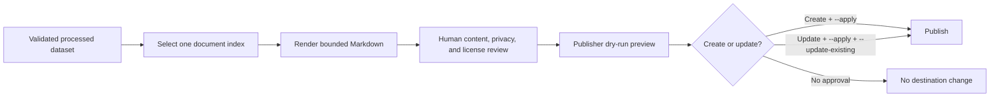

# PUB-002: Reviewed dataset publication

## Summary

| Field | Value |
|---|---|
| Phase ID | `PUB-002` |
| Status | Complete |
| Depends on | `PIPE-001`, `PIPE-002`, `STORE-001`, `PUB-001` |
| Scope | Safe handoff from one reviewed processed document to the universal `Publisher` contract |

This phase adds an explicit two-step publication workflow. `source render` converts one
validated dataset document into a bounded Markdown review artifact. The existing `publish`
command then previews that artifact and applies it only when requested. Updating an existing
destination additionally requires `--update-existing`.

## Background

Processed datasets contain normalized blocks, chunks, quality results, and source metadata.
They were suitable for review and storage but were not directly connected to documentation
publishers. Automatically sending all processed content to a Wiki would cross a privacy and
copyright boundary without a human-readable checkpoint. Source URIs may also contain
authentication query parameters and therefore must not appear in rendered output by default.

## User story / use case

As an open-source operator, I want to select one processed document, inspect a standalone
Markdown version, preview its publication locally, and explicitly approve creation or
replacement, so that unreviewed extracted content is never sent automatically to a local or
remote documentation destination.

## System constraints

- The source must be a valid local version-1 processed dataset.
- Exactly one processed outcome is selected by its non-negative report index.
- Document JSON, block count, and rendered Markdown are bounded.
- Source URI is excluded unless the operator explicitly opts in after reviewing it.
- Rendered Markdown may contain untrusted source Markdown or HTML and always requires review.
- Rendering cannot write inside its source dataset or replace a symbolic-link output.
- Existing render outputs are preserved unless `--overwrite` is explicit.
- Publication remains dry-run by default; apply and update are separate permissions.
- Remote permissions, visibility, transactions, and rollback remain provider responsibilities.

## Functional requirements

| ID | Requirement |
|---|---|
| `PUB-002-FR-01` | Validate the dataset and select one processed document by report index. |
| `PUB-002-FR-02` | Render title, document index, quality status, and normalized blocks as UTF-8 Markdown. |
| `PUB-002-FR-03` | Exclude source URI by default and include it only with `--include-source-uri`. |
| `PUB-002-FR-04` | Enforce document-byte, block-count, and publication-byte bounds. |
| `PUB-002-FR-05` | Atomically create the review artifact and protect existing files by default. |
| `PUB-002-FR-06` | Reject output inside the dataset, a symlink output file, and publisher source/destination symlinks. |
| `PUB-002-FR-07` | Keep `publish` in preview mode unless `--apply` is supplied. |
| `PUB-002-FR-08` | Require `--update-existing` with `--apply` before replacing an existing destination. |
| `PUB-002-FR-09` | Return a privacy-safe render receipt containing index, title, quality, path, bytes, and SHA-256. |

## Layouts and diagrams

## API requirements

| ID | Requirement |
|---|---|
| `PUB-002-API-01` | `render_dataset_document` is available from `doc_harvester.dataset_publication`. |
| `PUB-002-API-02` | `source render` requires dataset, document index, and explicit output. |
| `PUB-002-API-03` | Render bounds have safe environment defaults and matching CLI overrides. |
| `PUB-002-API-04` | The existing `PublishRequest`, publisher factory, and single-file destinations remain compatible. |
| `PUB-002-API-05` | `publish --update-existing` changes CLI authorization policy without changing adapter contracts. |

## Non-functional requirements

| ID | Requirement |
|---|---|
| `PUB-002-NFR-01` | The complete local review/publication flow works offline without optional dependencies. |
| `PUB-002-NFR-02` | Render and local publish writes are atomic at the destination-file boundary. |
| `PUB-002-NFR-03` | Defaults minimize disclosure and destructive writes. |
| `PUB-002-NFR-04` | Errors do not print document bodies, credentials, or source URIs. |
| `PUB-002-NFR-05` | Existing publisher adapters and legacy batch scripts remain compatible. |
| `PUB-002-NFR-06` | Full regression, packaging, secret, CI, and CodeQL checks remain green. |

## Logging and monitoring

`source render` prints a versioned JSON receipt with no document body and no source URI. The
publication command prints the selected provider, destination, status, and adapter metadata.
It does not provide durable audit storage. Production remote publication should be monitored
through the provider's revision history and audit logs; sanitized receipts may be retained
outside Git when an operational audit is required.

## Edge cases

- Missing, negative, skipped, failed, or duplicate document index.
- Missing/malformed/wrong-version document JSON or non-object blocks.
- Empty blocks, embedded Markdown/HTML, unusual headings, or backticks in metadata.
- Source URI containing tokens or private query parameters.
- Oversized document, excessive blocks, or oversized rendered Markdown.
- Existing output, output directory, output inside source dataset, or symlink output file.
- Empty/traversal-based publisher destination or source equal to local destination.
- Copy failure while replacing a local publication.
- Existing remote destination without update authorization.
- Permission, rate-limit, or partial remote-provider failure after preview.

## Acceptance criteria

| ID | Criterion | Verification |
|---|---|---|
| `PUB-002-AC-01` | One valid processed document renders to reviewable Markdown with an accurate receipt. | `PUB-002-TC-01`; render tests |
| `PUB-002-AC-02` | Source URI is absent by default and opt-in is explicit. | `PUB-002-TC-02`; privacy test |
| `PUB-002-AC-03` | Invalid, oversized, conflicting, or symlinked render input fails without corrupting data. | `PUB-002-TC-03`; negative tests |
| `PUB-002-AC-04` | Local preview/create succeeds and existing destinations require separate update approval. | `PUB-002-TC-04`; CLI tests |
| `PUB-002-AC-05` | Atomic local failure preserves the previous destination. | `PUB-002-TC-05`; fault-injection test |
| `PUB-002-AC-06` | Full regression, package, secret, PR, and post-merge checks pass. | `PUB-002-TC-06` |

## Decisions and open questions

| Status | Decision | Reason |
|---|---|---|
| Decided | Keep render and publish as separate commands. | Preserves a human review checkpoint before any provider operation. |
| Decided | Publish one selected document at a time. | Avoids accidental bulk publication and ambiguous destination mapping. |
| Decided | Exclude source URI by default. | Retrieval URLs can contain private identifiers or credentials. |
| Decided | Separate create, apply, and update permissions. | A replacement is more destructive than creating a missing destination. |
| Decided | Harden local publisher writes without changing the universal contract. | Improves safety for every existing local consumer. |
| Deferred | Batch mapping from dataset outcomes to destinations. | Needs a reviewed mapping schema and per-item authorization policy. |
| Deferred | Provider-neutral revision/rollback support. | Remote services expose incompatible revision models. |

## Implementation outcome

Implemented:

- bounded one-document Markdown rendering with privacy-safe defaults and SHA-256 receipt;
- additive `source render` command and canonical environment bounds;
- atomic render/local-publisher writes and filesystem/symlink protections;
- dry-run-first publication and explicit existing-destination update authorization;
- focused privacy, safety, CLI, configuration, and publisher regression tests.

Local verification on 2026-08-05:

- Ruff and complete standalone suite passed: 235 tests.
- Complete DocProc suite passed: 107 tests.
- Real local render/preview/create/update flow passed against the earlier reviewed dataset;
  rendered and published Markdown were byte-identical.
- Wheel build, content inspection, and extracted-wheel render/local-publish smoke passed.
- Complete 48-commit history scan found no leaks. The full working directory reported only
  the intentionally ignored local `.env`; it is excluded from the candidate public tree.

Public and post-merge verification on 2026-08-05:

- [PR #19](https://github.com/getanotherone/doc-harvester/pull/19) passed all seven checks
  with no conflicts and was squash-merged as `d700bf0`.
- Post-merge Ruff, 235 standalone tests, and 107 DocProc tests passed on `main`.
- Post-merge inspect-independent render/preview/local-publish smoke remained byte-identical.
- Complete merged history scan covered 50 commits and found no leaks.
