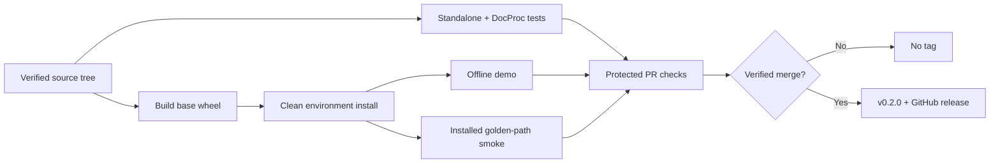

# REL-001: MVP release readiness

## Summary

| Field | Value |
|---|---|
| Phase ID | `REL-001` |
| Status | Complete |
| Depends on | `P0`, `P1`, `E2E-001` and all universal adapter phases |
| Scope | Prepare, verify, and publish the CLI-first `0.2.0` open-source MVP |

REL-001 converts the completed universal pipeline into a reproducible distribution. It
defines the MVP promise, removes unnecessary browser/OCR weight from the default wheel,
tests the installed artifact in CI, validates one bounded public technical page, and
prepares version/changelog/release evidence. Tagging occurs only after the candidate PR is
merged and its public checks pass.

## Background

Editable-install tests and synthetic fixtures proved the implementation, but an MVP also
needs a usable distribution boundary. Before this phase, every installation received
Playwright and OCR libraries even when using only the universal CLI, CI did not exercise the
built wheel, release metadata still said `0.1.0`, and no Git tag existed. A real standards
page also exposed that long unpunctuated/normative blocks could exceed `--max-tokens`.

## User story / use case

As a new open-source evaluator, I want to install a reasonably small release artifact and
complete the documented workflow with predictable limits, so I can assess the project
without legacy browser/OCR dependencies or maintainer-specific setup.

## System constraints

- The MVP promise is CLI-first; legacy crawler, API, and DocProc remain compatible but are
  not promoted as production-hosting guarantees.
- The base wheel must contain every universal CLI dependency and no Playwright/OCR library.
- Optional extras must fail with an actionable install message when explicitly requested.
- `max_tokens` is an absolute output ceiling, including long unpunctuated and normative text.
- Real-site validation is read-only, robots-compliant, bounded to one public page, and keeps
  all raw outputs outside Git.
- Version metadata, CLI version, changelog, README, tag, and GitHub release must agree.
- A tag/release is created only from the verified post-merge commit.

## Functional requirements

| ID | Requirement |
|---|---|
| `REL-001-FR-01` | Move Playwright and OCR Python libraries from base dependencies to `browser`, `ocr`, and `legacy` extras. |
| `REL-001-FR-02` | Return an actionable extra-install error when legacy `--spa` is requested without Playwright. |
| `REL-001-FR-03` | Split every non-table block so emitted chunks never exceed `max_tokens`. |
| `REL-001-FR-04` | Build/install the wheel in a clean CI environment and run demo plus golden-path smoke. |
| `REL-001-FR-05` | Define supported MVP outcomes, limitations, optional capabilities, and release criteria publicly. |
| `REL-001-FR-06` | Validate one robots-allowed public technical page with strict depth/page/byte/token limits. |
| `REL-001-FR-07` | Synchronize `0.2.0` package, CLI, README, and changelog metadata. |
| `REL-001-FR-08` | Create the `v0.2.0` tag and GitHub release only after the candidate merge is verified. |

## Layouts and diagrams

## API requirements

| ID | Requirement |
|---|---|
| `REL-001-API-01` | Project and runtime version are exactly `0.2.0`; release tag is `v0.2.0`. |
| `REL-001-API-02` | Existing base, `api`, `s3`, `wiki`, and `confluence` extras remain compatible. |
| `REL-001-API-03` | New optional extras are named `browser`, `ocr`, and `legacy`. |
| `REL-001-API-04` | Existing universal commands and version-1 artifact schemas remain unchanged. |
| `REL-001-API-05` | CI wheel smoke invokes the installed console script outside editable installation. |

## Non-functional requirements

| ID | Requirement |
|---|---|
| `REL-001-NFR-01` | Base installation is materially smaller and needs no browser/OCR system runtime. |
| `REL-001-NFR-02` | Chunk ceilings are deterministic and exact under the configured tokenizer. |
| `REL-001-NFR-03` | Release verification is reproducible without credentials or remote writes. |
| `REL-001-NFR-04` | Real-site evidence contains only sanitized counts/metrics, not copied source content. |
| `REL-001-NFR-05` | Full history and candidate scans find no secrets or generated real datasets. |
| `REL-001-NFR-06` | All required GitHub CI and CodeQL checks pass before tag creation. |

## Logging and monitoring

CI records build/install/test exit status and synthetic counts without uploading generated
datasets. The real-site run records only URL ownership, bounds, format, block/chunk counts,
maximum tokens, quality result, and robots disposition. Raw manifests/datasets remain under
a temporary ignored path. GitHub checks and the release page become the public release
audit; no production SLA or runtime telemetry is introduced.

## Edge cases

- Base wheel accidentally retains an OCR/browser transitive dependency.
- Optional `--spa` fails with a Python traceback rather than an installation hint.
- A long string has no sentence boundary, or a normative block exceeds the token ceiling.
- Token-based fallback splits one extremely long lexical token.
- Installed console script imports source-tree modules accidentally.
- CI loopback server is not ready or is left running after failure.
- Real public page changes, redirects, disallows robots, or exceeds response bounds.
- Package and runtime versions disagree.
- Tag points to a branch commit rather than the verified merge commit.
- Release is created while checks are pending or failing.

## Acceptance criteria

| ID | Criterion | Verification |
|---|---|---|
| `REL-001-AC-01` | Base wheel excludes browser/OCR dependencies and optional extras are exact. | `REL-001-TC-01`; metadata test |
| `REL-001-AC-02` | Missing SPA dependency produces an actionable safe failure. | `REL-001-TC-02`; CLI test |
| `REL-001-AC-03` | Long normal/normative input and the real RFC page never exceed 800 tokens. | `REL-001-TC-03`; unit + real smoke |
| `REL-001-AC-04` | Clean installed wheel completes version/demo/golden-path smoke. | `REL-001-TC-04`; local and CI job |
| `REL-001-AC-05` | Public MVP/release metadata is consistent and limitations are explicit. | `REL-001-TC-05`; docs/version checks |
| `REL-001-AC-06` | Full regression, secret, package, PR, and post-merge checks pass. | `REL-001-TC-06` |
| `REL-001-AC-07` | Verified merge commit is tagged and published as the GitHub MVP release. | `REL-001-TC-07` |

## Decisions and open questions

| Status | Decision | Reason |
|---|---|---|
| Decided | Release the CLI-first MVP as `0.2.0`. | `0.x` communicates API instability while marking the substantial universal workflow milestone. |
| Decided | Keep full legacy dependencies in Docker/`requirements.txt`. | Preserves the existing full-runtime deployment while slimming normal package installs. |
| Decided | Use RFC 9110 from the official RFC Editor for public smoke. | Stable public technical content, explicit robots allowance, and no redistribution in Git. |
| Decided | Fix absolute chunk bounds rather than accept a quality warning. | CLI documentation promises a hard maximum. |
| Decided | Publish a GitHub release before considering PyPI. | GitHub is sufficient for the first MVP distribution and avoids premature registry operations. |
| Deferred | PyPI publication and signed/provenance attestations. | Decide after the GitHub MVP receives installation feedback. |
| Deferred | Production SLA, hosted API deployment, and remote-provider certification. | Outside the CLI-first MVP promise. |

## Implementation outcome

Implemented:

- `0.2.0` package/runtime/README/changelog synchronization and explicit MVP scope;
- lightweight base dependencies plus `browser`, `ocr`, and combined `legacy` extras;
- actionable missing-browser CLI failure before legacy crawl/network behavior;
- exact splitting of long unpunctuated and normative blocks at the configured token ceiling;
- clean-wheel CI build/install/demo/golden-path job;
- sanitized real-world validation against the official RFC 9110 HTML page;
- completion of stale post-merge evidence for PIPE-002, STORE-001, and E2E-001.

Local verification on 2026-08-06:

- Ruff and focused release/packaging/chunking/CLI/E2E suite passed: 39 tests.
- Complete standalone suite passed: 264 tests.
- Complete DocProc suite passed: 107 tests.
- Clean Python 3.11 environment installed the base wheel, reported `0.2.0`, ran the demo,
  omitted Playwright/pdf2image/pytesseract, and processed four loopback resources.
- Wheel metadata exposed the three optional dependency groups exactly as specified.
- RFC 9110 processed into 2,104 blocks and 182 chunks with maximum 800 tokens, zero
  oversized chunks, and zero quality failures.
- Diff/workflow-YAML validation passed; complete 56-commit history scan found no leaks.

Public candidate verification on 2026-08-06:

- [PR #23](https://github.com/getanotherone/doc-harvester/pull/23) passed all eight checks:
  Python 3.11/3.12, DocProc, secrets, clean-wheel smoke, both CodeQL analyses, and CodeQL.
- GitHub reports the candidate as mergeable.

Post-merge verification passed. Tag `v0.2.0` and the public
[GitHub release](https://github.com/getanotherone/doc-harvester/releases/tag/v0.2.0) point
to verified commit `2fe7f40d0e178a802d976a786be6a7a2290640a8`.
