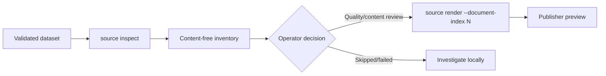

# REVIEW-001: Privacy-safe dataset inventory

## Summary

| Field | Value |
|---|---|
| Phase ID | `REVIEW-001` |
| Status | Complete; merge pending |
| Depends on | `PIPE-001`, `PIPE-002`, `STORE-001`, `PUB-002` |
| Scope | Bounded, content-free inventory of a version-1 processed dataset |

This phase adds `source inspect`, which turns raw processing artifacts into a concise review
inventory. It identifies selectable document indexes and exposes operational format, size,
and quality fields without printing document bodies, chunk bodies, source URIs, or raw errors
by default.

## Background

`source render` intentionally publishes one document index at a time, but operators previously
had to open `processing-report.json`, `document.json`, and `quality.json` manually to discover
which index to select. Those files contain source URIs, extracted content, and detailed errors,
making them unsuitable for casual terminal output or shared evidence.

## User story / use case

As an open-source operator, I want a safe summary of every processed, skipped, and failed
outcome so I can select a document for review, investigate quality warnings, and decide what
not to publish without exposing source content or private retrieval URLs.

## System constraints

- Input is a validated local version-1 processed dataset.
- Outcome indexes must be unique non-negative integers.
- Report, document, chunk, and quality JSON reads are bounded.
- Processed artifact arrays/counts and quality types are validated before summary output.
- Source URI disclosure is opt-in and may expose query parameters.
- Document/chunk text, raw failures, quality messages, and absolute dataset paths are never
  emitted by the inventory command.
- Inventory is read-only and does not render, store, or publish artifacts.

## Functional requirements

| ID | Requirement |
|---|---|
| `REVIEW-001-FR-01` | Validate dataset structure and unique non-negative outcome indexes. |
| `REVIEW-001-FR-02` | Summarize processed, skipped, and failed outcomes in deterministic index order. |
| `REVIEW-001-FR-03` | For processed outcomes, expose basename, media type, extractor, block/chunk counts, quality result, finding count/codes, and severity counts. |
| `REVIEW-001-FR-04` | For skipped outcomes, expose safe filename/media type/reason; for failures expose only `processing_failed`. |
| `REVIEW-001-FR-05` | Exclude source URIs by default and include them only with `--include-source-uri`. |
| `REVIEW-001-FR-06` | Never emit document/chunk text, raw failure details, quality messages, or dataset paths. |
| `REVIEW-001-FR-07` | Recalculate aggregate counts from inspected outcomes instead of trusting optional report counters. |
| `REVIEW-001-FR-08` | Enforce report, per-artifact, and outcome-count bounds. |

## Layouts and diagrams

## API requirements

| ID | Requirement |
|---|---|
| `REVIEW-001-API-01` | `inspect_dataset` is importable from `doc_harvester.dataset_review`. |
| `REVIEW-001-API-02` | `source inspect DATASET` emits version-1 JSON to stdout. |
| `REVIEW-001-API-03` | CLI exposes URI opt-in and positive report/artifact/document bounds. |
| `REVIEW-001-API-04` | Canonical bounds use `DOC_HARVESTER_MAX_REVIEW_ARTIFACT_BYTES` and `DOC_HARVESTER_MAX_REVIEW_DOCUMENTS`. |
| `REVIEW-001-API-05` | Existing processing, storage, rendering, and publishing APIs remain compatible. |

## Non-functional requirements

| ID | Requirement |
|---|---|
| `REVIEW-001-NFR-01` | Inspection works offline and performs no filesystem writes. |
| `REVIEW-001-NFR-02` | Output is deterministic and machine-readable UTF-8 JSON. |
| `REVIEW-001-NFR-03` | Default output is safe to use as sanitized evidence when filenames themselves are reviewed. |
| `REVIEW-001-NFR-04` | Invalid datasets fail without printing private artifact values. |
| `REVIEW-001-NFR-05` | Full regression, packaging, secret, CI, and CodeQL checks remain green. |

## Logging and monitoring

The command writes its inventory to stdout and concise validation errors to stderr. It has no
long-running service or external monitoring requirement. Redirected inventory files remain
operator-owned evidence and should be reviewed before sharing because filenames and explicit
URI opt-in can still disclose business context.

## Edge cases

- Empty dataset with no outcomes.
- Duplicate, Boolean, negative, or missing outcome index.
- Unknown outcome status.
- Missing, malformed, oversized, or wrong-version artifact JSON.
- Chunk count inconsistent with its array.
- Missing/non-Boolean quality result or malformed findings.
- Filename containing absolute/private directories or Windows separators.
- Finding code with spaces/control characters or excessive length.
- Raw failed outcome containing a private URL or provider response.
- Token-bearing source URI with and without explicit opt-in.
- Dataset exceeding the configured outcome count.

## Acceptance criteria

| ID | Criterion | Verification |
|---|---|---|
| `REVIEW-001-AC-01` | A mixed dataset produces accurate aggregate and per-outcome review fields. | `REVIEW-001-TC-01`; inventory tests |
| `REVIEW-001-AC-02` | Default output contains no source URI, bodies, raw error, quality message, or absolute source directory. | `REVIEW-001-TC-02`; privacy assertions |
| `REVIEW-001-AC-03` | URI disclosure occurs only after explicit opt-in. | `REVIEW-001-TC-02`; opt-in test |
| `REVIEW-001-AC-04` | Invalid schemas/indexes/counts and exceeded bounds fail safely. | `REVIEW-001-TC-03`; negative tests |
| `REVIEW-001-AC-05` | Inventory index can be passed to `source render` and local publish preview. | `REVIEW-001-TC-04`; local smoke |
| `REVIEW-001-AC-06` | Full regression, package, secret, PR, and post-merge checks pass. | `REVIEW-001-TC-05` |

## Decisions and open questions

| Status | Decision | Reason |
|---|---|---|
| Decided | Add inspection as a read-only command before render. | Makes document selection practical without weakening review gates. |
| Decided | Summarize raw failures as `processing_failed`. | Provider errors may contain private URLs or response text. |
| Decided | Use basenames only. | Absolute source paths disclose workstation/customer structure. |
| Decided | Output finding codes/counts, not messages. | Codes support triage without echoing arbitrary strings. |
| Decided | Keep URI opt-in separate from normal inspection. | Retrieval URLs frequently contain private identifiers. |
| Deferred | Filtering, pagination, and alternate table output. | First establish a stable JSON contract with real dataset feedback. |
| Deferred | Publication-plan generation. | Needs reviewed destination mapping and per-item authorization. |

## Implementation outcome

Implemented:

- bounded `inspect_dataset` API and additive `source inspect` command;
- unique non-negative dataset outcome-index validation;
- privacy-safe processed/skipped/failed summaries and explicit URI opt-in;
- canonical environment bounds and focused schema/privacy/CLI tests.

Local verification on 2026-08-05:

- Focused review/storage/source/config/publication suite passed: 43 tests.
- Ruff and complete standalone suite passed: 240 tests.
- Complete DocProc suite passed: 107 tests.
- Real local dataset inspection identified README index `0`, 48 blocks, 3 chunks, and passed
  quality without emitting its source URI; selected render and local preview then passed.
- Wheel build, content inspection, and extracted-wheel inspection smoke passed.

Public PR and post-merge checks remain pending.
