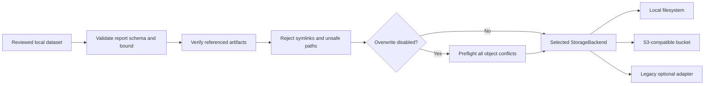

# STORE-001: Validated dataset storage

## Summary

| Field | Value |
|---|---|
| Phase ID | `STORE-001` |
| Status | Complete; merge pending |
| Depends on | `CORE-001`, `PIPE-001`, `PIPE-002` |
| Scope | Safe provider-neutral handoff of reviewed version-1 datasets to `StorageBackend` |

This phase adds `source store`: a universal command that validates a processed dataset and
stores its artifacts through local, S3-compatible, or legacy Yandex backends. It requires an
explicit provider-relative destination and protects existing objects by default.

## Background

The repository already had `StorageBackend`, local/S3/Yandex adapters, and a legacy `upload`
command. The universal `source` workflow did not validate that an input directory was a
complete processing dataset, and generic tree upload could follow file symlinks or discover
a destination conflict only after earlier files had already been written.

## User story / use case

As an open-source user, I want to review a locally processed dataset and then store exactly
its normalized artifacts under an explicit destination, so I can test locally first and later
switch to S3-compatible storage without risking silent overwrite or uploading linked files.

## System constraints

- Input must be a directory with a bounded version-1 `processing-report.json`.
- Every processed outcome must reference document, chunk, and quality JSON artifacts.
- Source roots and descendants must not be symbolic links.
- Local source and destination directory trees must not overlap.
- Destination prefixes must be non-empty, relative, and traversal-free.
- Existing targets are protected unless the user explicitly selects overwrite.
- Remote multi-object writes are not atomic and cannot be generically rolled back.
- Secrets remain environment-only and are never printed or stored in reports.

## Functional requirements

| ID | Requirement |
|---|---|
| `STORE-001-FR-01` | Validate dataset directory identity and bounded version-1 processing report before backend creation or writes. |
| `STORE-001-FR-02` | Verify processed outcome count and required `document.json`, `chunks.json`, and `quality.json` artifacts. |
| `STORE-001-FR-03` | Reject unsafe report directories, source symlinks, overlapping local trees, and unsafe destination prefixes. |
| `STORE-001-FR-04` | Route a validated tree through the selected universal storage backend. |
| `STORE-001-FR-05` | Preflight every target conflict before writing when overwrite is disabled. |
| `STORE-001-FR-06` | Keep overwrite disabled by default and expose explicit `--overwrite`. |
| `STORE-001-FR-07` | Return provider, destination, file count, and byte count without credential data. |
| `STORE-001-FR-08` | Support temporary S3 session credentials and canonical prefixed S3 configuration. |

## Layouts and diagrams

## API requirements

| ID | Requirement |
|---|---|
| `STORE-001-API-01` | `validate_dataset` and `store_dataset` are importable from `doc_harvester.dataset_storage`. |
| `STORE-001-API-02` | `source store` requires dataset and destination and exposes backend, bound, overwrite, local, and non-secret S3 options. |
| `STORE-001-API-03` | `StorageBackend.upload_tree` performs symlink rejection and all-conflict preflight. |
| `STORE-001-API-04` | `S3Storage` accepts optional session tokens for temporary credentials. |
| `STORE-001-API-05` | Canonical S3 variables use `DOC_HARVESTER_S3_*`; legacy unprefixed names remain compatible. |
| `STORE-001-API-06` | The root package and installed CLI include the new orchestration module/command. |

## Non-functional requirements

| ID | Requirement |
|---|---|
| `STORE-001-NFR-01` | Validation and local storage work offline without optional S3 dependencies. |
| `STORE-001-NFR-02` | Tree enumeration is deterministic and hidden files remain excluded. |
| `STORE-001-NFR-03` | No credentials or artifact content appear in storage summaries/errors. |
| `STORE-001-NFR-04` | Invalid datasets and preflight conflicts produce no new target objects. |
| `STORE-001-NFR-05` | Existing legacy upload and adapter APIs remain compatible. |
| `STORE-001-NFR-06` | Full regression, package, secret, CI, and CodeQL checks remain green. |

## Logging and monitoring

Successful CLI output contains only provider name, explicit destination, uploaded-file count,
and uploaded-byte count. Validation errors identify structure or safe relative filenames but
do not print document bodies or credentials. Remote providers should be monitored through
their object-operation, storage-usage, and billing dashboards.

## Edge cases

- Missing, oversized, malformed, or wrong-version processing report.
- Processed count inconsistent with report outcomes.
- Missing quality/document/chunk artifact.
- Absolute or traversal-based outcome/destination path.
- Dataset root symlink, nested file symlink, or hidden file.
- Local destination inside the source dataset, or source inside the target tree.
- One conflict late in a multi-file tree with overwrite disabled.
- Empty/skipped-only valid processing dataset.
- Temporary AWS credentials requiring a session token.
- S3-compatible endpoint with a provider-specific region.
- Remote failure after some objects were written.

## Acceptance criteria

| ID | Criterion | Verification |
|---|---|---|
| `STORE-001-AC-01` | A valid dataset stores all public artifacts locally with an accurate summary. | `STORE-001-TC-01`; integration tests |
| `STORE-001-AC-02` | Invalid structure/path/symlink input fails before storage writes. | `STORE-001-TC-02`; negative tests |
| `STORE-001-AC-03` | Default conflict handling protects all existing objects without partial new writes. | `STORE-001-TC-03`; preflight test |
| `STORE-001-AC-04` | Public CLI/configuration supports local and S3-compatible routing without CLI secrets. | `STORE-001-TC-04`; parser/config tests |
| `STORE-001-AC-05` | Temporary S3 credentials and prefixed/legacy configuration work through the adapter. | `STORE-001-TC-05`; fake-client tests |
| `STORE-001-AC-06` | Full regression, package, secret, PR, and post-merge checks pass. | `STORE-001-TC-06` |

## Decisions and open questions

| Status | Decision | Reason |
|---|---|---|
| Decided | Keep process and store as explicit separate commands. | Users can review quality output before an external write. |
| Decided | Require destination and default to no overwrite. | Prevents implicit bucket layout and destructive reruns. |
| Decided | Reject rather than follow symlinks. | Avoids uploading files outside the reviewed dataset. |
| Decided | Keep credentials in the SDK environment chain. | Avoids command history and process-list exposure. |
| Decided | Preflight conflicts but document non-atomic remote writes. | The universal contract has no portable transaction/delete primitive. |
| Deferred | Provider-neutral delete/rollback command. | Requires deliberate retention and safety policy. |
| Deferred | Atomic remote dataset pointer/manifest promotion. | Needs a versioned publication protocol. |

## Implementation outcome

Implemented:

- Bounded version-1 dataset validator and public storage orchestration API.
- Additive `source store` command with explicit destination and safe overwrite policy.
- Tree symlink rejection and all-target conflict preflight.
- Canonical S3 configuration, non-secret CLI overrides, and session-token support.
- Local, negative, boundary, CLI, configuration, and fake-S3 coverage.

Release verification evidence will be recorded after complete local and remote checks.

Local verification on 2026-08-05:

- Focused dataset/storage/CLI/configuration/compatibility suite: 54 passed.
- Complete standalone suite: 226 passed.
- Complete DocProc suite: 107 passed.
- Ruff, diff validation, wheel build/contents, and isolated installed-wheel
  discover/process/local-store smoke passed.
- Complete-history Gitleaks (43 commits) and staged public-tree Gitleaks passed.
- PR #17 standalone Python 3.11/3.12, DocProc, secrets, and CodeQL checks passed on
  implementation commit `7adabd5`.

Post-merge evidence will be recorded after merge checks finish.
