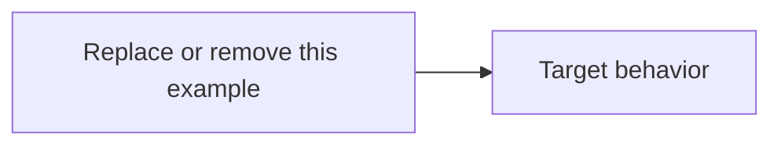

# {PHASE-ID}: {Phase title}

> Replace every placeholder, then remove this note. Use `Not applicable — {reason}` for a
> standard section that does not apply; do not silently delete it.

## Phase metadata

| Field | Value |
|---|---|
| Phase ID | `{DOMAIN-NNN}` |
| Status | Proposed / In progress / In validation / Complete / Blocked |
| Owner | `{name or GitHub handle}` |
| Started | `{YYYY-MM-DD}` |
| Completed | `{YYYY-MM-DD or Not applicable}` |
| Component | `{component or module}` |
| Related issue / PR | `{links}` |
| Manual tests | [manual-test-cases.md](manual-test-cases.md) |
| Operator documentation | `{link or Not applicable — reason}` |

## Summary

{Describe the intended outcome and current phase status in a short paragraph.}

## Background

{Explain the problem, current behavior, and why the phase is needed.}

## User story / use case

As a `{user or operator}`, I want `{capability}`, so that `{measurable value}`.

Secondary use cases:

- `{use case}`

## Scope

### In scope

- `{included behavior}`

### Out of scope

- `{explicitly excluded behavior}`

## System constraints

- `{runtime, platform, service, permission, compatibility, or legal constraint}`

## Assumptions and dependencies

- `{assumption or dependency, plus how it will be validated}`

## Functional requirements

| ID | Requirement |
|---|---|
| `{PHASE-ID}-FR-01` | `{Observable behavior using must or shall}` |

## Layouts and diagrams

{Add a UI layout, UML sequence/activity diagram, data-flow diagram, or ER diagram when it
materially clarifies the design. Otherwise write `Not applicable — reason`.}

## API requirements

| ID | Requirement |
|---|---|
| `{PHASE-ID}-API-01` | `{Endpoint, request, response, authorization, versioning, error, or idempotency requirement}` |

{If there is no API work, replace the table with `Not applicable — this phase has no API
surface.`}

## Data requirements

- `{schema, validation, migration, retention, compatibility, or privacy requirement}`

{If there is no persistent or exchanged data, state why this section is not applicable.}

## Non-functional requirements

| ID | Requirement |
|---|---|
| `{PHASE-ID}-NFR-01` | `{Security, privacy, performance, reliability, accessibility, usability, or compatibility requirement}` |

Use measurable thresholds where practical.

## Logging and monitoring

- `{required log, metric, alert, audit event, dashboard, and prohibited sensitive data}`

{If there is no runtime monitoring, explain how operators observe success and failure.}

## Security and privacy

- `{credential handling, authorization boundary, sensitive data, threat, or least-privilege rule}`

## Edge cases

- `{boundary, invalid state, partial failure, retry, timeout, concurrency, or recovery case}`

## Risks and mitigations

| Risk | Impact | Mitigation |
|---|---|---|
| `{risk}` | Low / Medium / High / Critical | `{prevention, detection, and recovery}` |

## Rollout, migration, and rollback

1. `{safe rollout step}`
2. `{verification or hold point}`
3. `{rollback or recovery step}`

{If no migration or external state is involved, state that explicitly.}

## Acceptance criteria

| ID | Criterion | Verification |
|---|---|---|
| `{PHASE-ID}-AC-01` | `{Binary, observable definition of done}` | `{PHASE-ID}-TC-01 and/or automated test link` |

Every acceptance criterion must link to at least one manual or automated test.

## Implementation outcome

{Complete this section during and after implementation. Record what shipped, deviations
from the original plan, and sanitized evidence.}

Implemented:

- `{completed behavior}`

Not completed or deferred:

- `{known limitation or follow-up}`

Verification evidence:

- `{test command and result, sanitized manual result, CI link, or artifact reference}`

## Decisions and open questions

| Status | Question or decision | Reason / owner |
|---|---|---|
| Open / Decided | `{question or decision}` | `{reason and responsible person}` |
